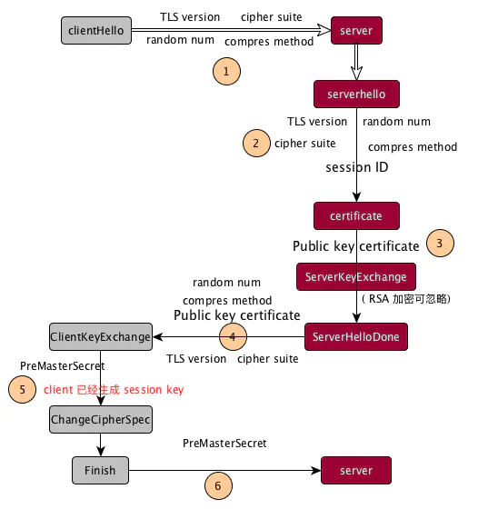
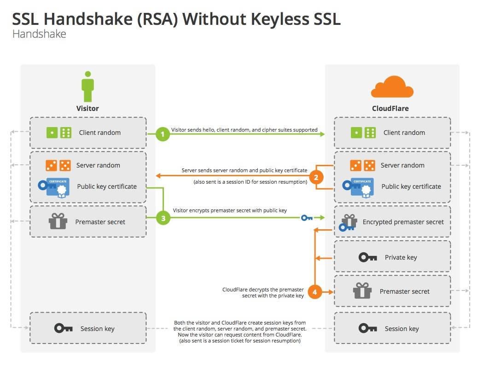
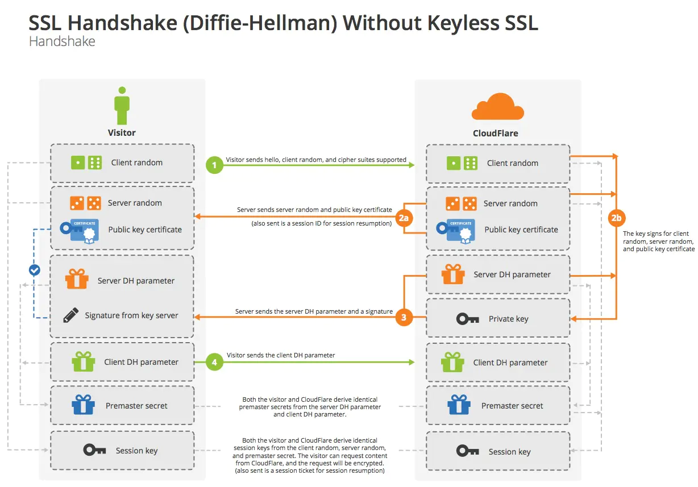
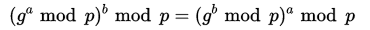
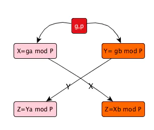
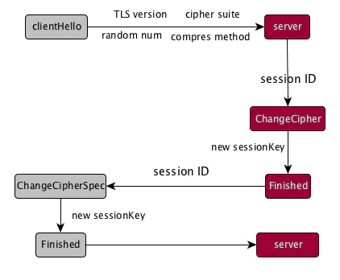

# SSL 证书解读

## 证书标准

X.509, 一种证书的标准, 定义了证书中包含的内容.


## 编码格式

同样的X.509证书, 可能有不同的编码格式, 目前有以下两种编码格式:

- PEM (Privacy Enhanced Mail), 文本格式, 以"----BEGIN..."开头, "----END..."结尾,
内容是 **BASE64** 编码

> Apache, *NIX 服务器使用

> 信息查看: openssl x509 -in certificate.pem -txt -noout

- DER (Distinguished Encoding Rules), 二进制格式, 不可读.

> Java 和 Windows 服务器使用

> 信息查看: openssl x509 -in certificate.der **-inform** -txt -noout


## 相关的文件扩展名

- **CRT**, 证书, **只保存证书,不保存私钥**, 常见 `UNIX 系统`, 可能是PEM编码, 也可能是DER编码

- **CER**, 证书, **只保存证书,不保存私钥**, 常见于 `Windows 系统`, 可能是PEM编码, 也可能是DER编码, 大多数是
DER编码

- **PFX/P12**, predecessor of PKCS#12, **同时包含证书和私钥, 一般有密码保护**. 

> 对 *NIX 服务器来说, 一般CRT和KEY是分开存放在不同的文件中, 但是Windows的IIS则将它们存在一个PFX文件中. 
> PFX通常会有一个"提取密码". PFX使用的是DER编码.


从pfx当中提取 **证书**, **私钥**, **公钥**:

```bash
# certificate: pfx -> pem
openssl pkcs12 -in certificate.pfx -nodes -out cert.pem 

# private key
openssl pkcs12 -in certificate.pfx -nocerts -out key.pem

# public key
openssl pkcs12 -in certificate.pfx -clcerts -nokeys -out key.pem
```

- **JKS, Java Key Storage**, **同时包含证书和私钥, 一般有密码保护**, keytool工具可以将 `JKS` 转为 `PFX`, 

keytool 也能直接生成JKS

从jks当中提取  **证书**, **私钥**, **公钥**:

```bash
# jks -> p12
keytool -importkeystore \
    -srckeystore keystore.jks \
    -destkeystore keystore.p12 \
    -deststoretype PKCS12 \
    -srcalias <jkskeyalias> \
    -deststorepass <password> \
    -destkeypass <password>

# export certificate: p12 -> pem 
openssl pkcs12 -in keystore.p12  -nokeys -out crt.pem

# export private key
openssl pkcs12 -in keystore.p12  -nodes -nocerts -out key.pem

# export public key
keytool -export \
    -keystore keystore.jks \
    -alias <jkskeyalias> \
    -file key.pem
```


- **KEY**, 公钥或者私钥, 并非X.509证书, 可能是PEM编码, 也可能是DER编码

> 查看方法: openssl rsa -in mykey.key -text -noout
>         openssl rsa -in mykey.key -text -noout -inform der


- **CSR**, 证书签名请求(Certificate Signing Request), 这个并不是证书, 而是向 **CA** 获得签名证书的申请. 
**核心内容是一个公钥** (当然还附带了一些别的信息), 在生成这个申请的时候, 同时也会生成一个私钥, 私钥要自己保管好.

> 查看方法: openssl req -text -noout -in my.csr

生成csr文件:

```bash
# key.pem 是私钥, my.csr是证书签名请求
openssl req -newkey rsa:2048 -new -nodes -keyout key.pem -out my.csr
```

## 生成密钥,证书

- 第一步, 为服务器端和客户端准备公钥, 私钥

```bash
# 生成服务器端私钥
openssl genrsa -out server.key 1024
# 生成服务器端公钥
openssl rsa -in server.key -pubout -out server.pem


# 生成客户端私钥
openssl genrsa -out client.key 1024
# 生成客户端公钥
openssl rsa -in client.key -pubout -out client.pem
```

- 第二步, 生成 CA 证书 (CA机构)

CA (Catificate Authority), 它的作用就是提供证书(即服务器证书, 由域名,公司信息,序列号和签名信息组成), 加
强服务端和客户端之间信息交互的安全性, 以及证书运维相关服务. 任何个体/组织都可以扮演 `CA` 的角色, 只不过难以得
到客户端的信任, 能够受浏览器默认信任的 `CA` 大厂商有很多, 其中 `TOP5` 是 `Symantec, Comodo, Godaddy, 
GolbalSign 和 Digicert`.

```bash
# 生成 CA 私钥
openssl genrsa -out ca.key 4096

# X.509 Certificate Signing Request (CSR) Management. (CA生成证书签名请求)
openssl req -new -key ca.key -out ca.csr

# X.509 Certificate Data Management. (CA自签证书, 10年)
openssl x509 -req -days 3650 -in ca.csr -signkey ca.key -out ca.crt
```

- 第三步, 生成服务器端证书和客户端证书

```bash
# 服务器需要向CA机构申请签名证书, 在签名证书之前依然是创建自己的CSR文件
# 需要输入服务器的相关内容(Country, Provence, City, Organization, Organization Unit, 
# Common Name [服务器名称, server FQDN, 必填], Email, Optional Pwd, Optional company)
openssl req -new -key server.key -out server.csr

# CA机构签名, 需要CA的证书和私钥参与, 最终颁发一个带有CA签名的证书
# ca.crt ca.key 是CA独有的内容
# server.csr server端的签名证书请求
# server.crt 生成的签名证书
openssl x509 -req -days 365 -CA ca.crt -CAkey ca.key -CAcreateserial -set_serial 01 -in server.csr \
-out server.crt
```

## 证书使用

签名操作是 `发送方`(CA机构) 用私钥进行签名, `接受方`(客户端) 用发送方证书(客户端内置的证书)来验证签名;

加密操作是 `发送方`(客户端) 用接受方的证书进行加密, `接受方`(服务器) 用自己的私钥进行解密.

因此, 如果说数字证书是电子商务应用者的网上数字身份证话, 那么证书相应的私钥则可以说是用户的私章或公章.


## TLS/SSL 支持的算法集合

> Go1.13 版本提供的支持

```
// TLS 1.0 - 1.2 cipher suites.
TLS_RSA_WITH_RC4_128_SHA                uint16 = 0x0005
TLS_RSA_WITH_3DES_EDE_CBC_SHA           uint16 = 0x000a
TLS_RSA_WITH_AES_128_CBC_SHA            uint16 = 0x002f
TLS_RSA_WITH_AES_256_CBC_SHA            uint16 = 0x0035
TLS_RSA_WITH_AES_128_CBC_SHA256         uint16 = 0x003c
TLS_RSA_WITH_AES_128_GCM_SHA256         uint16 = 0x009c
TLS_RSA_WITH_AES_256_GCM_SHA384         uint16 = 0x009d
TLS_ECDHE_ECDSA_WITH_RC4_128_SHA        uint16 = 0xc007
TLS_ECDHE_ECDSA_WITH_AES_128_CBC_SHA    uint16 = 0xc009
TLS_ECDHE_ECDSA_WITH_AES_256_CBC_SHA    uint16 = 0xc00a
TLS_ECDHE_RSA_WITH_RC4_128_SHA          uint16 = 0xc011
TLS_ECDHE_RSA_WITH_3DES_EDE_CBC_SHA     uint16 = 0xc012
TLS_ECDHE_RSA_WITH_AES_128_CBC_SHA      uint16 = 0xc013
TLS_ECDHE_RSA_WITH_AES_256_CBC_SHA      uint16 = 0xc014
TLS_ECDHE_ECDSA_WITH_AES_128_CBC_SHA256 uint16 = 0xc023
TLS_ECDHE_RSA_WITH_AES_128_CBC_SHA256   uint16 = 0xc027
TLS_ECDHE_RSA_WITH_AES_128_GCM_SHA256   uint16 = 0xc02f
TLS_ECDHE_ECDSA_WITH_AES_128_GCM_SHA256 uint16 = 0xc02b
TLS_ECDHE_RSA_WITH_AES_256_GCM_SHA384   uint16 = 0xc030
TLS_ECDHE_ECDSA_WITH_AES_256_GCM_SHA384 uint16 = 0xc02c
TLS_ECDHE_RSA_WITH_CHACHA20_POLY1305    uint16 = 0xcca8
TLS_ECDHE_ECDSA_WITH_CHACHA20_POLY1305  uint16 = 0xcca9

// TLS 1.3 cipher suites.
TLS_AES_128_GCM_SHA256       uint16 = 0x1301
TLS_AES_256_GCM_SHA384       uint16 = 0x1302
TLS_CHACHA20_POLY1305_SHA256 uint16 = 0x1303
```


## TLS/SSL 过程

关键词:

> - session key: TLS/SSL 最后协商的结果, 用来进行对称加密
>
> - client random: 一个 32B 的序列值, 每次连接来时, 都会动态生成. 即, 每次连接生产的值都会不一样. 因为它包含了 4B
> 的时间戳和 28B的随机数.
>
> - server random: 和 client random一样, 只是由 server 端生成.
>
> - premaster secret: 这是 48B 的 blob 数据. 它能和 client & server random 通过 pseudorandom(PRF) 一起生
> 成 session key.
>
> - cipher suite: 用来定义 TLS 连接用到的算法. 通常有 4 部分:
>> 1)非对称加密(ECDH或RSA)
>>
>> 2)证书验证(证书的类型)
>>
>> 3)保密性(对称加密算法)
>>
>> 4)数据完整性(产生hash的函数)
>
> 例如: ECDH-ECDSA-AES256-GCM-SHA384 代表, ECDH 算法进行非对称加密, ECDSA 进行证书验证, 256bit AES 对称加密,
> 384bit SHA 数据签名.



1.客户端发送 clientHello 信息, 包含了客户端支持的最高 TLS协议版本, random num, cipher suite. 如果客户端使用的
resumed handshake, 那么这里发送的就是 sessionid. 如果客户端还支持 ALPN, 那么它还需要发送它所支持的其他协议, 比如
HTTP/2.

2.在 server 端进行 serverHello 阶段, 这里 server 根据 cient 发送过来的相关信息, 采取不同的策略, 同样还会发送和
client 端匹配的TLS最高版本信息, cipher suite 和 自己产生的 random num. 并且, 这里会产生该次连接独一无二的 
sessionid.

3.通过 certificate 阶段, 会在信息流中加入 public key certification. ServerKeyExchange 该阶段, 主要是针对 
ECDH 加密方式.

4.serverHelloDone 标识 server 阶段处理结束, 该阶段产生的信息发送给 client.

5.clientKeyExchange 阶段时, client 会随机生产一串 pre-master secret 序列, 并且会经由 public key 加密, 然后
发送给 server. 在 ChangeCipherSpec 阶段, 主要是 client 自己, 通过 pre-master secret + server random-num
`+` client random-num 生成 sessionKey. 这个标志着在 client 端, TLS/SSL 过程已经接近尾声.

6.后面在 server 端进行的 ChangeCipherSpec 和 client 进行的差不多, 通过使用 private key 解密 client 传过来的
pre-master secret, 然后生成 sessionKey. 后面再通过一次验证, 使用 sessionKey 加密 server finished, 发送给 
client, 观察能否成功解密, 来表示最终的 TLS/SSL 完成.

---

> RSA 具体流程




> DH 具体流程



---

> DH 算法科普:

原理公式:



为了防止在 DH 参数交换时, 数据过大, DH 使用的是取模数的方式, 这样就能限制传输的值永远在 `[1, p-1]`. 这里, 先说明一
下 DH 算法的基本条件:

- 公有条件: p 和 g 都是已知, 并且公开. 即, 第三方也可以随便获取到.

- 私有条件: a 和 b 是两端自己生成的, 第三方获取不到.

基本流程:



将上图的 DHparameter 替换为相对应的 X/Y 即可. 而最后的 Z 就是我们想要的 pre-master secret. 之后, 就和 RSA 加密
算法一致, 加上两边的 random-num 生成 sessionKey.

> 小结:
> RSA 和 DH 两者之间的具体区别就在于: RSA会将 premaster secret 显示的传输, 这样有可能会造成私钥泄密引起的安全问题.
> 而 DH 不会将 premaster secret 显示的传输.

## TLS/SSL 中的基本概念

### Forward Secrey

FS(Forward Secrey) 主要是针对 private key 进行描述的. 如果你的 private key 能够用来破解以前通信的 session 内
容, 比如, 通过 private key 破解你的 premaster secret, 得到了 sessionkey, 就可以解密传输内容了. 这种情况就是 
non-forward-secrey. 那如何做到 FS 呢? 使用 DH 加密方式即可. 因为, 最后生成的 sessionKey 和 private key 并没
有直接关系, premaster secret 是通过 `g(ab) mode P` 得到的.

### ALPN

ALPN(Application Layer Protocol Negotiation, 应用层协议协商机制). 在应用层中, HTTP 协议应该是重点. 不过由于
HTTP 版本的问题, 以及现在 HTTP/2 的流行, 为了让 client-server 使用相同的协议二出现了 ALPN. 

- 在 clientHello 阶段, client 会在 message 中, 添加一个 ProtocolNameList 字段. 用来代表它所支持的协议列表.

- server 端在 serverHello 阶段, 处理 client 提供的 ProtocolNameList. 并且选择最高版本的协议, 执行. 将选择信息
添加到 serverHello 内.

### SNI

SNI(Server Name Indication), 该机制的提出意义是, 当有一个 server 同时处理了很多个 host 时. 就相当于, 一个 IP 
映射多个域名, 但是证书只能对一个 3 级域名有效, 所以, 针对于多个 host 来说, server 为了能同时兼顾这些郁闷, 一种简单的
方法就是重定向到指定域名; 如果都想支持的话, 可以多买几个证书. 如果现在一个 IP 服务器下, 搭载了支持多个域名的 server,
并且每个域名都有合法的 CA 证书. 那么 server 怎么判断, 哪一个域名用哪一个证书呢? 这时候, 需要用到 SNI. 相当于在 TLS 
阶段, 将 host 一并发送过去, 然后 server 就知道在 serverHello 阶段该返回啥证书了.

为什么一定要用 SNI ?

我们这里只是建立了 TCP + TLS 连接, 客户端的一些内容, 比如 hostname, 并不能在 TCP 中获得. 而想获得, 就需要在 HTTP
阶段, 获得 client 传过来的 `host` 或 `origin` 字段. 所以, 为了解决这个尴尬的点, 就提出了 SNI.


### Session Resumption

为了提升性能, 减少请求次数, 提出了 Session ID 和 Session Tickets, 将成功进行连接的 session 内容缓存起来.

#### Session ID

Session ID 是 server 讲上一次成功连接的 session 内容存在自己的硬盘里面. 这里, 就不涉及对 session data 的二次加
密. 基本过程是:

1. client 端在 clientHello 阶段, 将 random num, TLS protocol 和 通过 hostname 匹配得到是最新一次的 Session
ID 发送给 server 端 (侧面说明, client 同样需要存储一份 session data).

2. server 接收到 Session ID 之后, 在缓存中查找, 如果找到, 则直接进行 ChangeCipher 阶段, 开始生成 sessionKey.
然后, 返回相同的 Session ID.

那么, 相对于完全的 TLS/SSL 连接来说, 这里只用到了一次 RTT.




#### Session Tickets

Session Tickets 和 Session ID 做的是同样的事情. server 将最新一次的 session data 通过 二次加密, 在上一次握手
结束时传递过去, 然后 client 将传递过来的信息保存. 这样, 利不利用缓存的 session data, 这时取决于 client. 如果该次
的 session data 没有过期, 那么 client 就会在 clientHello 阶段将该数据发送过去, server 收到后, 便开始进行解密,
然后, 双方生成 sessionKey, 握手结束.

> Session ID 和 Session Tickets 到底使用哪个? Session ID 节省性能, 而损耗部分空间. Session Tickets 注重的是
> 节省空间, 而损耗部分性能. 两者都能节省一次 RTT 时间.
