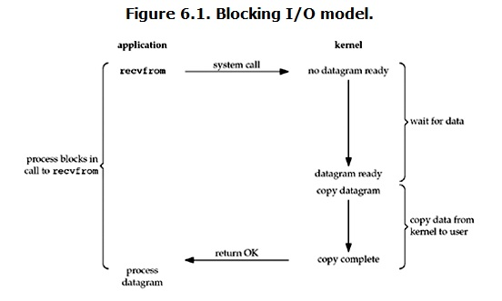

# Linux IO模式及 select、poll、epoll详解

## 用户空间 和 内核空间

现在操作系统都是采用虚拟存储器, 那么对32位操作系统而言, 它的寻址空间(虚拟存储空间)为4G(2的32次方).

操作系统的核心是内核, 独立于普通的应用程序, 可以访问受保护的内存空间, 也有访问底层硬件设备的所有权限. 

为了保证用户进程不能直接操作内核(kernel), 保证内核的安全, 操作系统将虚拟空间划分为两部分, 一部分为内核空间,
一部分为用户空间.

针对linux操作系统而言, 将最高的1G字节(从虚拟地址0xC0000000到0xFFFFFFFF), 供内核使用, 称为内核空间,
而将较低的3G字节(从虚拟地址0x00000000到0xBFFFFFFF), 供各个进程使用, 称为用户空间.

## 文件描述符fd

文件描述符(File descriptor)是计算机科学中的一个术语, 是一个用于表述指向文件的引用的抽象化概念.

文件描述符在形式上是一个非负整数. 实际上, 它是一个索引值, 指向内核为每一个进程所维护的该进程打开文件的记录表.
当程序打开一个现有文件或者创建一个新文件时, 内核向进程返回一个文件描述符. 在程序设计中, 一些涉及底层的程序编写往往
会围绕着文件描述符展开. 但是文件描述符这一概念往往只适用于UNIX、Linux 这样的操作系统.

## 缓存IO

缓存IO又称为标准IO, 大多数文件系统默认IO操作都是缓存IO.

在Linux的缓存IO机制当中, 操作系统会将IO的数据缓存在文件系统的页缓存(page cache)中. 即, 数据先会被拷贝到操作系统内核
的缓冲区中, 然后才从系统内核的缓冲区拷贝到应用程序的地址空间.

缓存IO的问题: 

数据在传输过程中需要在应用程序地址空间和内核进行多次数据的拷贝操作, 这些数据拷贝操作所带来的CPU以及内存开销是非常大的.

## IO 模式

一次IO访问(如read操作), 数据会先被拷贝到操作系统内核的缓冲区中, 然后才会从操作系统内核的缓冲区拷贝到应用程序的地址空间.

read操作的发生, 会经历两个阶段:

- 等待数据准备

- 将数据从内核拷贝到进程中

因为这两个阶段, Linux系统产生了5种网络模式的方案.

- 阻塞IO (blocking IO)

- 非阻塞IO (nonblocking IO)

- IO多路复用 (IO multiplexing)

- 信号驱动IO (signal driven IO)

- 异步IO (asynchronous IO)

### 阻塞IO (blocking IO)

Linux当中, 默认情况下所有的socket都是blocking.

当用户进程调用了recv()/recvfrom()这个系统调用, 

kernel就开始了IO的第一个阶段: 准备数据(对于网络IO来说, 很多时候数据在一开始还没有到达. 比如,还没有收到一个完整的UDP包.
这个时候kernel就要等待足够的数据到来). 这个过程需要等待, 也就是说数据被拷贝到操作系统内核的缓冲区中是需要一个过程的. 而
在用户进程这边, 整个进程会被阻塞(当然, 是进程自己选择的阻塞).

第二个阶段: 当kernel一直等到数据准备好了, 它就会将数据从kernel中拷贝到用户内存, 然后kernel返回结果, 用户进程才解除
block的状态, 重新运行起来.

> blocking IO的特点就是在IO执行的两个阶段都被block了.

### 非阻塞IO (nonblocking IO)

[!image](resource/nonblock_io.png)

同步非阻塞就是"每隔一会儿瞄一眼进度条"的轮询(polling)方式. 在这种模型中, 设备是以非阻塞的形式打开的.
这意味着IO操作不会立即完成, read操作可能会返回一个错误代码, 说明这个命令不能立即满足(EAGAIN或EWOULDBLOCK).

在网络IO时候, 非阻塞IO也会进行recvform系统调用, 检查数据是否准备好, 与阻塞IO不一样, "非阻塞将大的整片时间的阻塞
分成N多的小的阻塞, 所以进程不断地有机会 '被' CPU光顾".

即非阻塞的recvform系统调用调用之后, 进程并没有被阻塞, 内核马上返回给进程, 如果数据还没准备好, 此时会返回一个error.

进程在返回之后, 可以干点别的事情, 然后再发起recvform系统调用. 重复上面的过程, 循环往复的进行recvform系统调用.
这个过程通常被称之为轮询. 轮询检查内核数据, 直到数据准备好, 再拷贝数据到进程, 进行数据处理. 
需要注意, 拷贝数据整个过程, 进程仍然是属于阻塞的状态.

> nonblocking IO的特点是用户进程需要不断的主动询问kernel数据好了没有.

### IO多路复用(IO multiplexing)

IO multiplexing就是select,poll,epoll. 也称为event driven IO. select/epoll的好处就在于单个process可以同时
处理多个网络连接IO. 基本原理就是select, poll, epoll这个function会不断的轮训所负责的socket, 当某个socket数据到达
之后, 就通知用户进程.
 
[!image](resource/multiplex.png)

当用户进程调用了select, 那么整个进程会被block. 而与此同时kernel会"监听"所有select负责的socket, 当任何一个socket
中的数据准备好了, select就会返回. 这个时候用户进程再调用read操作,将数据从kernel拷贝到用户进程.

> IO多路复用的特点是通过一种机制, 一个进程能同时等待多个文件描述符, 而这些文件描述符(套接字描述符)其中的任意一个进入就绪
状态, select()函数就可以返回.

IO multiplexing 相对 blocking IO并没有太大的不同, 事实上, 还更差些. 因为IO多路复用使用了2个system call(select
和recvfrom), 而 blocking IO 只调用了一个system call(recvfrom), 但是, 使用select的优势在于它可以同时处理多个连接.

如果处理的连接数不是很高的话, 使用select/epoll的server不一定比使用multi-threading+blocking IO的server性能更好, 
可能延迟还更大. select/epoll的优势不是对于单个连接处理得更快, 而是在于能处理更多的连接.

在IO multiplexing中, 实际上对于每个socket, 一般都设置成non-blocking, 但是, 整个用户的process其实一直都被block的.
只不过process是被select这个函数block, 而不是socket IO给block.

### 异步IO(asynchronous IO)

一般来说, 这些函数通过告诉内核启动操作并在整个操作(包括内核的数据到缓冲区的副本)完成时通知我们. 

异步IO和信号驱动IO模型的主要区别是:
信号驱动I/O中, 内核告诉我们何时可以启动I/O操作, 
异步I/O时, 内核告诉我们何时I/O操作完成.

相对于同步IO, 异步IO不是顺序执行. 用户进程进行aio_read系统调用之后, 无论内核数据是否准备好, 都会直接返回给用户进程, 
然后用户态进程可以去做别的事情. 等到socket数据准备好了, 内核直接复制数据给进程, 然后从内核向进程发送通知. IO两个阶段, 
进程都是非阻塞的.

Linux提供了AIO库函数实现异步, 但是用的很少. 目前有很多开源的异步IO库, 例如libevent, libev, libuv.

