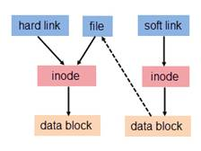

# Linux 软链接 与 硬链接

## 硬链接与软连接的联系与区别

文件都有文件名和数据, 这在Linux上被分为两部分: 用户数据(user data) 与 元数据(metadata). 用户数据, 即文件数据块(
data block), 数据块是记录文件真实内容的地方; 元数据是文件的附加信息, 如文件大小, 创建时间, 所有者等信息. 在Linux中, 
元数据中的inode号(inode是文件元数据的一部分但其实不包含文件名, inode号即索引节点号)才是文件的唯一标识而非文件名.

Linux系统中查看inode号可使用stat或ls -i.

为了解决文件的共享使用, Linux系统引入了两种链接: 硬链接(hard link)与软连接(又称符号链接,即soft link或symbolic link)
链接为Linux系统解决了文件的共享使用, 还带来了隐藏文件路径, 增加权限安全以及节省存储等好处. 若一个inode号对应多个文件名, 
则称这些文件为硬链接. 换言之, 硬链接就是同一个文件使用了多个别名.

硬链接的特性:

- 文件有相同的inode及data block;
- 只能对已存在的文件进行创建;
- 不能交叉文件系统进行硬链接的创建;
- 不能对目录进行创建, 只可对文件创建;
- 删除一个硬链接文件并不影响其他有相同inode号的文件

文件old.file与hard.link有着相同的inode号及文件权限. inode是随着文件的存在而存在, 因此只有当文件存在时才可创建硬链接,
即当inode存在且链接计数器(Links)不为0时. 

inode号仅在各文件系统下是唯一的, 当Linux挂载多个文件系统后将出现inode号重复的现象, 因此硬链接创建时不可跨文件系统.

硬链接不能对目录创建是受限于文件系统的设计. 现Linux文件系统中的目录均隐藏了两个特殊的目录: 当前目录(.) 和 父目录(..).
查看这两个特殊目录的inode号可知其实这两个目录就是两个硬链接. 若系统允许对目录创建硬链接, 则会产生目录环.

软连接与硬链接不同, 若文件用户数据块中存放的内容是另一文件的路径名的指向, 则该文件就是软连接. 软连接就是一个普通文件,只是
数据块内容有点特殊. 软连接有着自己的inode号以及用户数据块. 因此软连接的创建与使用没有类似硬链接的诸多限制:

- 软连接有自己的文件属性及权限等;
- 可对不存在的文件或目录创建软连接;
- 软连接可交叉文件系统;
- 软连接可对文件或目录创建;
- 创建软连接时, 链接计数i_nlink不会增加;
- 删除软连接并不影响被指向的文件, 但若被指向的原文件被删除, 则相关软连接被称为死链接(即dangling link)

软链接数据访问:

当然软连接的用户数据也可以是另一个软连接的路径, 其解析过程是递归的. 但需要注意: 软连接创建时原文件的路径指向使用绝对路径较
好. 使用相对路径创建的软连接被移动后该软链接将会成为一个死链接.