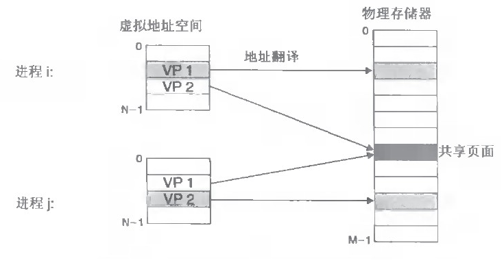
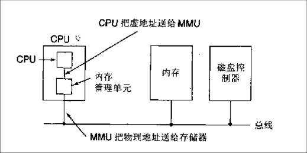
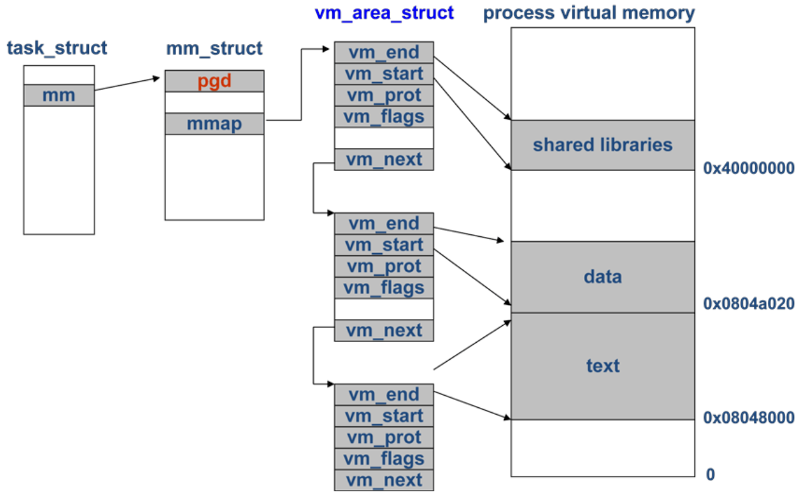

# Linux 下的内存管理

程序内存地址 => 虚拟内存 => 物理内存

## Linux 虚拟内存和物理内存的理解

1.每个进程的4G内存空间是虚拟内存空间, 每次访问内存空间的某个地址, 都需要把地址翻译为实际物理内存地址.

2.所有进程共享同一物理内存, 每个进场只把自己目前需要的虚拟内存空间映射并存储到物理内存上.

3.进场要知道哪些内地址上的数据在物理内存上, 哪些不在, 还有在物理内存上的那些, 需要用 `页表` 来记录.

> 页表的每一个表项分两部分: 第一部分记录此页是否在物理内存上, 第二部分记录物理内存页的地址(如果存在)

4.当进程访问某个虚拟地址时, 去查询页表, 如果发现对应的数据不在物理内存中, 则产生 `缺页中断`.

> 缺页中断的处理过程, 就是把进程需要的数据从磁盘上拷贝到物理内存中, 如果内存已经满了, 没有空地方联动, 那就找一个页进行
> 覆盖, 当然如果被覆盖的页曾经被修改过, 需要讲此页写回磁盘.

> **优点:**
> 
> - 既然每个进程的内存空间都是一致且固定的, 所以 *链接器在链接可执行文件时, 可以设定内存地址*, 而不用去管这些数据最终
> 实际的内存地址, 这是有独立内存空间的好处.
> - 当不同的进程使用同样的代码时, 比如库文件的代码, *物理内存中可以只存储一份*这样的代码, 不同的进场只需要把自己的虚拟
> 内存映射过去就可以了, 节省内存.
> - 当程序*需要分配连续的内存空间*的时候, 只需要在虚拟内存空间分配连续空间, 而不需要实际物理内存的连续空间, 可以利用碎
> 片.

## 处理器内核(软核)是否带有 MMU 单元

> MMU (内存映射单元), 通常是CPU的一部分, **本身有少量的存储空间**来存放从虚拟地址到物理地址的查找表; 所有数据请求都
> 送往MMU, 由MMU决定数据是在RAM内还是在大容量存储设备内; 也能将用用程序的执行对应到不同虚拟内存的空间中, 让操作系统提
> 供内存保护.

### MMU 功能

- 在 Linux 的运行环境中, MMU是必不可少的重要单元. 如果没有MMU对 memory 进行管理, 那么操作吸引面对的是单一的物理地址,
如果地址线是32位, 那么操作系统能够管理的只有 4 GB 空间, 正是引入 MMU:

> - 操作系统可使用虚拟地址来进行映射
> - MMU 的地址翻译和地址保护

- Linux 操作系统在运行过程中, 会涉及虚拟地址到物理地址的转换, 这就是 MMU 功能模块完成的任务.

### MMU 工作原理

- 如果软件需要控制 MMU, 需要通过系统内部的协处理器对某些寄存器进行读操作, 来获取MMU的状态; 通过向某些寄存器发起写操作
来控制 MMU 的操作

- MMU 单元可以提供全面的内存管理(`执行多任务程序需要的地址装换和权限检查`), 因此多用户应用程序可以在这个 CPU 内核的支
持下运行.

- 在打开 MMU 功能模块后, 它对数据池和指令池发出的地址称为虚拟地址:

> - 在内存中找到该地址域对应的转换页, 把虚拟地址的高位部分替换, 形成可以访问内存, 寄存器的物理地址.
> - 在这些`转换页`中, 有对该部分地址域限定的权限信息. 结合处理器的当前状态, 这些转换页提供的权限信息即可让处理器判断此
> 次的读写访问是否合法:
> 1.如果合法, 处理器会在存储空间中按照物理地址进行读写操作
> 2.如果非法, 处理器会发出数据访问或指令读取异常标志, 这些标志信号将引导处理器进入异常中断向量中.

- 现代操作系统普遍采用虚拟内存管理机制, 这需要MMU的支持. MMU 通常是CPU的一部分, 如果处理器没有MMU, 或者`有MMU但没有
启用`, **CPU执行单元发出的内存地址将直接传到芯片引脚上**, 被`内存芯片(物理内存)`接收, 这里的地址称为物理地址. 如果
处理器启用了 MMU, **CPU执行单元发出的内存地址将被MMU截获**, 从 CPU 到 MMU 的地址称为虚拟地址. 而MMU将这个地址翻
译成另一个地址发送到CPU芯片的外部地址引脚上, 也就是将虚拟地址转换为物理地址.

## 硬件页表 vs 软件页表

- `现在Linux内核是 4 级页表结构, 3级页表结构的时代是10年前了`.

- X86_64 架构下, 无论是 Intel 还是 AMD 的 CPU, 都是4级的硬件页表, 所以软件层面的页表至少要 4 级(否则, 进程访问的
空间将受限, 因为有一级虚拟页表被固定住了, 3级页表, X86_64只能访问 512 GB 空间, 4级页表, X86_64的可访问空间达到了
31072(2^47)GB)

- i386 只有三级硬件页表: PUD -> PMD -> PTE. `怎么嵌入四级页表结构? 答案是虚设一级`

> - 用户空间虚拟地址, 按照上述的四级进行翻译
> - 内核空间虚拟地址是所有进场共享的, 重要的是, 从效率角度看, 如果同样走四级页表翻译的流程, 速度太慢. 于是, 内核初始化
> 时, 就创建内核空间的映射(因为所有进程共享, 有一份就足够了), 并且, `采用线性映射`, 而不是走页表翻译这种类似哈希表的方
> 式.
> - `为什么用户空间不能也像内核空间这么做`? 用户地址空间是随进场创建才产生的, 它的页面可能散步在不同的物理内存中, 无法
> 这么做. 另外, 走页表的过程, 不止是翻译的过程, 还是一个权限检查的过程, 对于不可控的用户态地址, 这样的安全性检查必不可
> 少. 而内核空间, 只有一份, 所有可以提前固定下来一片连续的物理地址空间, 按线性方法映射 (按前面的线性方法, 1G内核空间,
> 只能映射1G物理地址空间, 这对内核来说, 太掣肘了; Linux内核只对1G内核空间的前 896 M 按前面所说的方法线性映射, 剩下的
> 128M 的内核空间 `[高端内存]`, 采用动态映射的方式, 即按需映射的方式, 这样内核态的访问空间更多了).

## 几级页表 + MMU

### Linux 内存管理

- 以32位的系统来说, 对于 4GB 的虚拟内存, 系统要怎样来管理该内存呢? 一般就是采用所谓的 `分页机制`, 就是把这么大的内存
按照每一页的大小分成很多页, 内存的管理也就是以页作为单位, 而不是以字节作为单位.

> 4GB 的地址, 如噶按照每一页 4K 大小计算的话, 那么总共需要的页数为 2^20, 这时就需要一个页目录来存储这些页的信息, 以
> 便查找. `每一个页项存储的就是对应页的内存起始地址`, 每一项的大小为 32bit (4B), 页目录所需要的内存大小为 2^20*4B
> 也就是4MB的大小

- 对于进程来说 一般不会使用这么大的内存空间, 加上程序对内存的访问具有局部性, 这样的话, 就会出现很多的页表项不会被用到,
也就是程序所需要的页数很少. 如果一直将所有的页目录存储在内存的话(4MB), 或造成很大的内存浪费, 此时就出现了多级页表了.

> - 以二级页表来说, 将总的页目录按照页的大小(4KB) 划分, 总共需要的二级页数为 4MB/4KB=1K, 此时引入一级页表, 用来存
> 储二级页表的信息, 那么每一个一级页表项的大小为4B, 所需要的一级页表大小为 4KB.
>
> - 进程在运行的时间, 只需要先读取一级页表,接着再根据对二级页表以及内存页进行配置, 可以大大减少页的索引信息了.

- 对于一个线性地址(虚拟地址), 内存怎样把它映射为对应的物理地址呢?

> - 在二级页表下, 一级页的大小为 4KB, 也就是对应 1K 的二级页表, 索引要索引二级页表, 需要将虚拟地址的高10位用来作作为
> 一级页表的表内偏移索引
>
> - 通过一级页表的表内偏移索引找到二级页表后, 二级页表也有1K的页数, 所以需要虚拟地址中的低10位作为二级索引页表的表内偏
> 移索引
>
> - 在得到对应的物理地址页地址的时候,由于每一页有4K大小, 想要找到具体的字节地址, 那么需要12位的索引, 也就是32位地址剩
> 下的低12位. 这样就完成了一个虚拟地址到实际物理地址的映射
>
> - 对于一级页表, 其起始地址要怎样存储?
>
> 1) 一般的话, 由于起始地址是一个4B的指针, 可以存储在寄存器上
> 2) 每次进程运行的时候, 每一个进程都有字节的一级页表起始地址, 当进程被加载运行的时候, 操作系统为其分配的一级页表地址就
> 直接存在CR3寄存器中, 这样开始了进程的虚拟地址访问.

- 完成虚拟地址到物理地址的转换一般是 MMU (Memory Management Unit)硬件来实现的.  为了实现更快的转换, 就有了 TLB (
Transaction Lock-aside Buffer),  用来根据程序访问内存的局部性机制来缓存已经转换过的虚拟页与实际页的对应关系!

> - TLB中包含了最近使用过的页面的内存映射信息, 处理器提供了专门的电路来并发地读取并比较TLB的页面映射项.
>
> - 对于频繁使用的虚拟地址, 它们很可能在 TLB 中对应有对应的映射项, 因而处理器可以绝对快速地将虚拟地址转译成物理地址; 
> 反之, 如果一个虚拟地址没有出现在 TLB 中, 那么处理器必须采取以上介绍的两次查表过程(两次访问内存)才能完成地址转译. 在
> 这种情况下, 这一次内存访问会慢一些, 但是, 经过两次访问以后, 此虚拟页面与对应物理页面之间的映射关系将被记录到TLB中,
> 所以, 下次再访问此虚拟页面时, 处理器可以从 TLB 中实现快速转译, 除非此映射项已经被移除了.
>

### Linux 4级页表的演进

内核用户空间

## 虚拟内存地址空间

