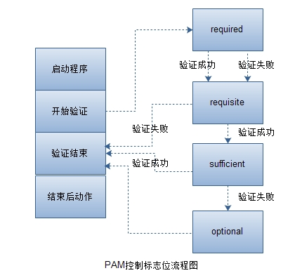

# PAM

## PAM概述

PAM代表可插入身份验证模块(Pluggable Authentication Modules). 这些模块提供额外的身份验证规则,
保护对计算机的访问.

---

首先讨论一个基本问题: 

>究竟为什么要使用PAM? \
>如果每个程序不得不定义自己的身份验证逻辑, 就会很混乱.
>
>如何确定所有应用程序都实现了相同的测试和检查? 如果需要额外的控制手段,那么怎么办? 难道要重新编写所有程序吗? \
>在计算机科学领域, 有时候可以用额外的一层解决所有问题, 至少在安全方面是这样. 如果一个程序需要验证用户的身份,它可以调用 
PAM API.这个 API 负责执行在 PAM 配置文件中指定的所有检查. 这种方法还允许方便地修改身份验证规则, 所有感知 PAM 的
程序都会自动地应用新规则,不需要修改它们的代码. 如果希望使用某种生物学检查(比如虹膜扫描器或指纹采集器),而且生产商提供了
PAM,就可以方便地设置它. 在配置文件中包含模块调用, 所有应用程序就可以使用这个设备了.


## 配置 PAM

PAM 提供四个安全领域的特性,但是应用程序不太可能同时需要所有这些方面.

- account 处理账户限制.对于有效的用户,允许他做什么?
- auth 处理用户识别 -- 例如,通过输入用户名和密码.
- password 只处理与密码相关的问题,比如设置新密码.
- session 处理连接管理,包括日志记录.

在 `/etc/pam.d` 目录中为将使用 PAM 的每个应用程序创建一个配置文件, 文件名与应用程序名相同. 例如,`login`命令
的配置文件是 `/etc/pam.d/login`.

必须定义将应用哪些模块, 创建一个动作"堆". PAM 运行堆中的所有模块, 根据它们的结果允许或拒绝用户的请求.还必须定义
检查是否是必需的. 最后, other 文件为没有特殊规则的所有应用程序提供默认规则.


- optional 模块可以成功,也可以失败; PAM 根据 **模块是否最终成功** 返回 `success` 或 `failure`.
- required 模块必须成功. **如果失败, `PAM` 返回 `failure`, 但是会在运行堆中的其他模块之后返回**.
- requisite 模块必须成功. **如果失败, `PAM` 立即返回 `failure`, 不再运行其他模块**.
- sufficient **模块在成功时 `PAM` 立即返回 `success`, 不再运行其他模块.**


配置文件的结构很简单. 可以包含注释, 注释以散列符 `#` 开头; 通过在换行处加上反斜杠 `\`, 可以把长的行分为多行.
行有三个字段: 领域 **(account, auth, password 或 session)**, 控制标志**(optional, required, 
requisite 或 sufficient)**, 运行的模块的路径和参数. 

>注意: 第二个字段可以更复杂; 另外, 可以使用include规则以包含其他文件中的规则,比如 auth include common-account.


**验证流程如下:**



## 常用的PAM

在所有的发行版都包含以下模块中的大多数. 请检查模块的 `/lib/security` 或 `/usr/lib/security` 目录, 对
于 `64` 位操作系统, `/lib/x86_64-linux-gnu/security`. 
如果需要更多信息, 可以尝试执行 **man the.name.of.the.module**, 而不要直接执行它; PAM 不是可执行的二进制代码.

- pam_access 根据 `/etc/security/access.conf` 文件允许或拒绝访问.

- pam_cracklib 和 pam_pwcheck 检查新密码的强度.

- pam_deny 和 pam_permit 是基本模块, 分别 `拒绝` 或 `允许` 访问.

- pam_echo 向用户显示指定文件的内容.

- pam_lastlog 向用户显示他上一次登录的日期和时间.

- pam_ldap.so 让用户根据 LDAP 服务器进行身份验证, 提供跨网络的集中式身份验证.

- pam_limits 模块允许指定系统资源限制, 限制在 `/etc/security/limits.conf` 文件中定义.

- pam_listfile 提供根据一个配置文件的内容允许或拒绝服务的另一种方法.

```
配置参数:
pam_listfile.so 
    item=[tty|user|rhost|ruser|group|shell] 
    sense=[allow|deny] 
    file=/path/filename 
    onerr=[succeed|fail] 
    [apply=[user|@group]]

item: 配置文件的内容, 即需要检查的内容
sense: 当在配置文件当中找到内容的时候执行的动作.
file: 配置文件路径
onerr: 当发生错误的时候执行的动作.
apply: 限制用户类别. 注意, 对于item=[user|ruser|group]内容, 此参数没有意义. 但是对于item=[tty|
rhost|shell] 它有意义.

item说明:
user -- 用户名
tty -- 产生请求的终端的名称
rhost -- 产生请求的主机名称
ruser -- 产生请求的主机登录的用户名

#
# deny ftp-access to users listed in /etc/ftpusers
#
auth    required pam_listfile.so \
        onerr=succeed item=user sence=deny file=/etc/ftpusers

#
# permit login to users listed in /etc/loginusers
#
auth    required pam_listfile.so \
        onerr=fail item=user sence=allow file=/etc/loginusers
```

- pam_mail 检查用户是否有未处理的邮件.

- pam_motd 向用户显示 "message of the day" 文件. 

- pam_nologin 如果 `/etc/nologin` 文件存在, pam_nologin 阻止所有登录.

- pam_rootok 允许root用户访问, 不执行进一步检查. `/etc/pam.d/su` 中常常包含这个模块; 必需的行是 
**auth sufficient pam_rootok.so**. 根用户可以作为任何用户操作, 不需要提供密码.

- pam_succeed_if 检查账户的特定属性, 比如是否是某个组的成员.

- pam_securetty 模块用于控制root用户登录系统的时候所使用的终端. 限定管理员只能通过安全的tty登录.
`/etc/securetty` tty就是传统终端.

- pam_time 可以根据 `/etc/security/time.conf` 中的规则限制对服务的访问.

- pam_tally2 登录次数统计

- pam_unix(或pam_unix2) 提供基于 `/etc/passwd` 和 `/etc/shadow` 文件的传统 UNIX 身份验证.

- pam_userdb 根据一个 Berkeley 数据库执行身份验证.

- pam_warn 在系统日志(syslog)中记录信息(service, terminal, user, remote user, remote ip).

- pam_wheel 只向 `wheel` 组的成员提供根访问权; 必需的行是 **auth required pam_wheel.so**

```
参数配置:
pam_wheel.so 
    [debug] 
    [deny] 
    [group=name] 
    [root_only] 
    [trust]

debug: 打印debug信息
deny: 授权的反向操作. 如果用户尝试获取root权限并且这个用户属于wheel组(或者这个用户是group配置的组的成员), 拒绝访问.
如果用户尝试获取root权限并且不属于wheel组(或者这个用户也不是group配置的组的成员), 返回PAM_IGNORE(如果trust选项被
指定, 此时返回PAM_SUCCESS)

group: 替换要检查的wheel组或者root组. 使用"name"组去执行授权验证.

root_only: 仅仅对wheel组的成员进行检查.

trust: 如果user是wheel组的成功, 返回PAM_SUCCESS, 而不是PAM_IGNORE(免密码的关键)
```