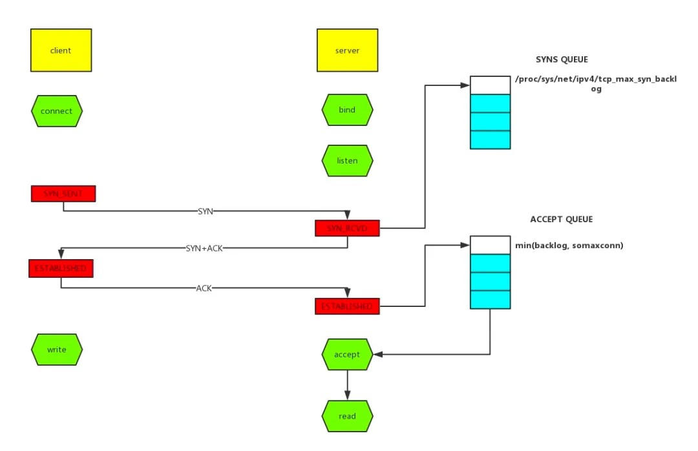

## 线上故障排查

线上故障主要包括 **CPU**, **磁盘**, **内存** 以及 **网络** 的问题, 而大多数故障可能会包含不止一个层面
的问题, 所以进行排查时候要尽量四个方面依次排查一遍.


### CPU

一般来讲首先排查 CPU 方面的问题. CPU 异常往往是比较好定位的. 原因包括业务逻辑问题(死循环), 频繁 GC 以及
上下文切换过多.

① CPU 问题

首先使用 `ps` 命令找到对应的进程的 pid (如果有好几个目标进程, 可以使用 `top` 看一下哪个占用比较高)

接着使用 `top -H -p pid` 找到CPU使用率比较高的线程.


② 上下文切换

针对频繁上下文切换问题, 使用 `vmstat` 命令进行查看.

> vmstat delay count
>
> delay是时间间隔,  count是总的次数

```
quinn@master:~$ vmstat 1 5
procs -----------memory---------- ---swap-- -----io----  -system--  ------cpu-----
 r  b   swpd   free   buff  cache   si   so    bi    bo   in   cs   us sy id wa st
 0  0      0 4169096  96568 2115664    0    0   437   389  575 1542 10  2 80  8  0
 0  1      0 4162940  96616 2120592    0    0     0   816 1931 5147  2  1 84 14  0
 0  0      0 4164304  96632 2120484    0    0     0    56 1664 4407  2  1 95  2  0
 0  0      0 4163972  96632 2120544    0    0     0    16 1682 4404  2  0 98  0  0
 1  0      0 4163304  96632 2120552    0    0     0     0 1645 4235  2  1 97  0  0
```

cs (context switch) 一列代表了上下文切换的次数.

us, 用户cpu使用率
sy, 系统cpu使用率
id, cpuu空闲
wa, cpu等待


针对特定的 pid 进行监控, 可以使用 `pidstat -w -p pid` 命令, cswch 和 nvcswch 表示自愿和非自愿切换.

> **pidstat [option]  -p { pid, SELF, ALL }   -T { TASK | CHILD | ALL }  [ interval ]  \[ count ]**
> [option] 包括:
>   -d, Report I/O 统计信息
> ​  -R, Report 实时优先级和调度策略的信息
>   -r, Report page faults 和 memory 信息
>   -s, Report stack 信息
>   -u, Report CPU 信息
>   -v, Report 内核信息
>   -w, Report task switch 信息

```
> pidstat -w -p 1 1 5
Linux 4.15.0-29-generic (work) 	05/16/2020 	_x86_64_	(8 CPU)

11:23:19 AM   UID       PID   cswch/s nvcswch/s  Command
11:23:20 AM     0         1      0.00      0.00  systemd
11:23:21 AM     0         1      0.00      0.00  systemd
11:23:22 AM     0         1      0.00      0.00  systemd
11:23:23 AM     0         1      0.00      0.00  systemd
11:23:24 AM     0         1      0.00      0.00  systemd
Average:        0         1      0.00      0.00  systemd
```

### 磁盘

磁盘问题和 CPU 一样是属于比较基础的. 首先是磁盘方面, 直接使用命令 `df -lh` 查看文件系统的信息.

更多时候, 磁盘问题还是性能问题. 可以通过 `iostat -d -k -x` 来分析.

```
> iostat -d -k -x 2
Linux 4.15.0-29-generic (work) 	05/16/2020 	_x86_64_	(8 CPU)

Device:  rrqm/s  wrqm/s   r/s   w/s  rkB/s   wkB/s avgrq-sz avgqu-sz  await r_await w_await  svctm  %util
loop0      0.00    0.00  0.00  0.00   0.00    0.00     3.20     0.00   0.00    0.00    0.00   0.00   0.00
sda        0.00    1.20  0.60  0.85  33.36    9.78    59.64     0.03  19.61   39.73    5.52   3.34   0.48
sdb        0.09    3.45  1.30  3.27  54.32  143.73    86.74     0.04   9.20   26.01    2.53   0.35   0.16
```

%util 磁盘繁忙程度. 100%代表磁盘繁忙, 0%代表磁盘空闲. 注意, 磁盘繁忙不代表磁盘利用率高.

svctm 一次IO请求的服务时间. 对于单块盘, 完全随机读时, 基本在 7ms 左右, 即寻道+旋转延迟时间.

avgrq-sz 提交给驱动层的IO请求大小. 一般不小于4k, 不大于max(readahead_kb, max_sectors_kb), 可用于判断当前的IO模
式, **一般情况下, 尤其是磁盘繁忙时, 越大代表顺序, 越小代表随机.**

rrqm/s 和 wrqm/s 分别的读写的速度. 一般能够定位到具体哪块磁盘出问题了.

%util = (r/s + w/s) * svctm / 1000

avgrq-sz = (rMB/s + wMB/s) * 2048 / (r/s + w/s) # 2048 = 1M/512


另外还需要知道哪个进程在进行读写, 一般来说开发者自己心里有数, 或者利用 `iotop` 命令来进行定位文件读写的来源.


> ``` 
> iotop [ -p PID ]  [ -d DELAY ] [ -n NUM ] [-k, --kilobytes] [-t, --time]
> 通过 DELAY 可以指定周期, 默认是 1s, NUM 指定周期次数限制, 默认没有限制, 一致打印
> -k, --kilobytes 是以 KB 为单位
> -t, --time 是显示时间
> ```

```
Total DISK READ :       0.00 K/s | Total DISK WRITE :       3.59 K/s
Actual DISK READ:       0.00 K/s | Actual DISK WRITE:       0.00 K/s
  TID  PRIO  USER     DISK READ  DISK WRITE  SWAPIN     IO>    COMMAND                                                                  
 1243 be/4 syslog      0.00 K/s    3.59 K/s  0.00 %  0.00 % rsyslogd -n [rs:main Q:Reg]
    1 be/4 root        0.00 K/s    0.00 K/s  0.00 %  0.00 % init
    2 be/4 root        0.00 K/s    0.00 K/s  0.00 %  0.00 % [kthreadd]
    3 be/4 root        0.00 K/s    0.00 K/s  0.00 %  0.00 % [ksoftirqd/0]
    7 be/4 root        0.00 K/s    0.00 K/s  0.00 %  0.00 % [rcu_sched]
    8 be/4 root        0.00 K/s    0.00 K/s  0.00 %  0.00 % [rcu_bh]
    9 rt/4 root        0.00 K/s    0.00 K/s  0.00 %  0.00 % [migration/0]
```


通过 TID, 需要转换成 PID. 可以通过 `readlink` 来找到 `readlink -f /proc/*/task/TID/../..`

```
# readlink -f /proc/*/task/1243/../..
/proc/1136
```

找到 PID 之后, 可以通过 `lsof` 确定具体文件读写的情况. `lsof -p pid`

```
COMMAND   PID   USER   FD   TYPE   DEVICE  SIZE/OFF       NODE NAME
rsyslogd 1136 syslog  cwd    DIR   259,1      4096          2 /
rsyslogd 1136 syslog  rtd    DIR   259,1      4096          2 /
rsyslogd 1136 syslog  txt    REG   259,1    599328      23993 /usr/sbin/rsyslogd
rsyslogd 1136 syslog  mem    REG   259,1     25344      29219 /usr/lib/rsyslog/lmnsd_ptcp.so
rsyslogd 1136 syslog  mem    REG   259,1     47648       2018 /lib/x86_64-linux-gnu/libnss_nis-2.23.so
rsyslogd 1136 syslog  mem    REG   259,1     93128       1991 /lib/x86_64-linux-gnu/libnsl-2.23.so
rsyslogd 1136 syslog  mem    REG   259,1     35688       2006 /lib/x86_64-linux-gnu/libnss_compat-2.23.so
rsyslogd 1136 syslog  mem    REG   259,1     10496      29208 /usr/lib/rsyslog/lmtcpclt.so
```

---

### 网络

涉及到网络层面的问题一般都比较复杂, 场景多, 定位难.

这里举一些例子, 并从 TCP 层, 应用层 以及工具的使用方面来阐述.

① 超时

超时错误大部分处在应用层面, 所有这块着重理解概念. 超时大体可分为 `连接超时` 和 `读写超时`, 某些使用连接池的
的客户端框架还会存在 `获取连接超时` 和 `空闲连接清理超时`.


读写超时: readTimeout/writeTimeout, 有些框架叫做 so_timeout 或者 socketTimeout, 均指的是数据读写超
时.

> 注意这边超时大部分是指逻辑上的超时. soa 的超时指的也是读超时. 读写超时一般都只针对客户端设置.


连接超时: connectionTimeout, 客户端通常指 `与服务段建立连接的最大时间`.

服务端这边 connectionTimeout 就有些五花八门了. 

② TCP 队列溢出

TCP 队列溢出是个相对底层的错误, 它可能会造成超时, RST 等更表层的错误. 因此错误也更隐蔽.




如图所示, 这里有两个队列:

- syns queue (半连接队列)
 
- accept queue (全连接队列)

三次握手, 在 server 收到 client 的 SYN 请求后, 把消息放到 syns queue, 回复 ACK + SYN 给 client,
server 收到 client 的 ACK.

如果这时 accept queue 没满, 那就从 syns queue 拿出暂存的信息放入 accept queue 中, 否则要按照
`tcp_abort_on_overflow` 配置的执行.

tcp_abort_on_overflow=0, 表示如果三次握手第三步的时候 accept queue 满了话, 那么 server 丢弃掉 client
发过来的 ack.

tcp_abort_on_overflow=1, 表示如果三次握手第三步的时候 accept queue 满了, server 会发送一个 RST 包
给 client, 表示废掉这个握手过程和这个连接, 这意味着日志里可能会有多个 `connection reset` / `connection 
reset by peer`

在实际的开发中, 快速定位 TCP 队列溢出:

netstat 命令, 执行 `netstat -s|egrep "listen|LISTEN"`

```
> netstat -s|egrep "listen|LISTEN"
    4869 times the listen queue of a socket overflowed
    4872 SYNs to LISTEN sockets dropped
```

overflowed 表示 accept queue 队列溢出的次数

sockets dropped 表示 syns queue溢出的次数

ss 命令, 执行 `ss -lnt`

```
$ ss -lnt
State      Recv-Q Send-Q  Local Address:Port    Peer Address:Port              
LISTEN     0      128                 *:27017              *:*               
```

Send-Q 表示 Listen 端口上的全连接队列的最大值

Recv-Q 表示 全连接队列当前使用了多少

如何设置 全连接, 半连接队列的大小? 全连接队列大小取决于 min(backlog, somaxconn)

Backlog 是 Socket 创建的时候传入的, somaxconn 是一个 OS 级别的系统参数. 

而半连接队列大小取决于 max(64, /proc/sys/net/ipv4/tcp_max_syn_backlog)


③ RST 异常

RST 包表示连接重置, 用于关闭一些无用的连接, 通常表示异常关闭, 区别于四次挥手.

在实际的开发中, 常常会看到 `connection reset/connection reset by peer` 这种错误, 这种情况就是 RST 包
导致的.


端口不存在: 如果向不存在的端口发出建立连接 SYN 请求, 那么服务器发现字节并没有这个端口, 则直接返回一个 RST 报
文, 用于中断连接.


主动代替 FIN 终止连接: 一般来说, 正常的连接关闭都是需要通过 FIN 报文实现, 然而我们也可以用 RST 报文代替 FIN,
表示直接终止连接.

实际开发中, 可设置 SO_LINGER 数值来控制, 这种往往是故意的, 来跳过 TIME_WAIT, 提高交互效率.

客户端或服务端有一边发生了异常, 该方向向对端发送 RST 以告知关闭连接: TCP 队列溢出发送 RST 包就是属于这一种.

这种往往是由于某些原因, 一方无法再能正常处理请求连接了(程序崩溃, 队列满了等), 从而告知另一方关闭连接.


接收到的 TCP 报文不在已知的 TCP 连接内: 比如, 一方机器由于网络实在太差 TCP 报文失踪了, 另一方关闭了该连接,
然后过了许久收到了之前失踪的 TCP 报文, 但是由于 TCP 连接已不存在, 那么会直接发一个 RST 包以便开启新的连接.

一方长期未收到另一方的确认报文, 在一定时间或重传次数后发出 RST 报文. 这种大多数也和网络环境相关了, 网络环境差
可能会导致更多的 RST 报文.

之前说过 RST 报文多会导致程序报错, 在一个已关闭的连接上读操作会报 `connection reset`, 而在一个已关闭的连接
上写操作会导致 `connection reset by peer`

通常我们可能还会看到 `broken pipe` 错误, 这是管理通道层面的错误, 表示对已关闭的管道进行读写, 往往是收到 RST
报文, 报出 `connection rest` 错之后继续读写数据的错, 这个在 glibc 源码注释当中也有介绍.


排查故障时候怎么确定有 RST 包的存在呢? 使用 tcpdump 命令进行抓包, 并使用 wireshark 进行简单分析.

`tcpdump -i eth0 tcp -w xxx.cap`, 其中 eth0 标识监听的网卡.


④ TIME_WAIT 和 CLOSE_WAIT

在线上时, 直接使用命令 `netstat -n| awk '/^tcp/{++S[$NF]} END {for (a in S) print a, S[a]}'` 
来查看 TIME_WAIT 和 CLOSE_WAIT 是数量.

使用 ss 命令会更快 `ss -ant | awk '{++S[$1]} END {for (a in S) print a, S[a]}'`

```
$ ss -ant | awk '{++S[$1]} END {for (a in S) print a, S[a]}'
CLOSE-WAIT 6
ESTAB 38
LISTEN 17
State 1
FIN-WAIT-1 3
```

TIME_WAIT: TIME_WAIT 的存在一是为了防止丢失的数据包被后面连接复用, 二是为了在 2MSL 的时间范围内正常关闭
连接.

它的存在其实会大大减少 RST 包的出现. 过多的 TIME_WAIT 在短连接频繁的场景比较容易出现.

这种情况下可以在服务端做一些内核参数优化:

```
# 开启重用, 允许TIME_WAIT sockets 重用于新的 TCP 连接. 默认是0, 表示关闭
net.ipv4.tcp_tw_reuse = 1 


# 开启 TCP 连接中 TIME_WAIT sockets 的快速回收, 默认是0 表示关闭
net.ipv4.tcp_tw_recycle = 1
```

当然不用忘记 NAT 环境下因为时间戳错乱导致数据包被拒绝的坑了, 另外的办法就是改小 tcp_max_tw_buckets
超过这个数的 TIME_WAIT 都会被干掉, 不过会也会导致 `time wait bucket table overflow` 的错.


CLOSE_WAIT: CLOSE_WAIT 往往是因为应用程序写的有问题, 没有在 ACK 后再次发起  FIN 报文．

CLOSE_WAIT 出现的概率甚至比 TIME_WAIT 要更高, 后果更严重. 往往是由于某个地方阻塞住了, 没有正常关闭连
接, 从而渐渐地消耗完所有的线程.
