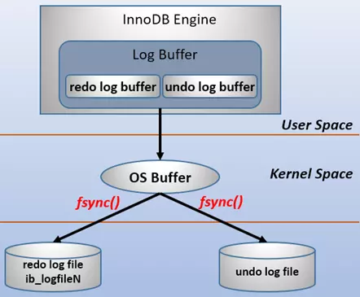
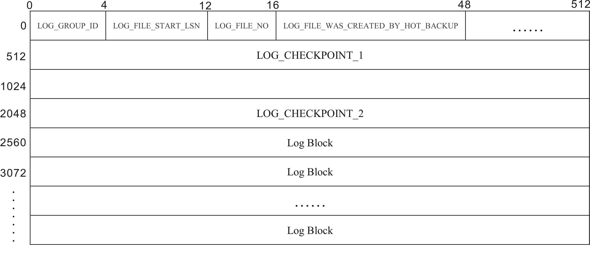
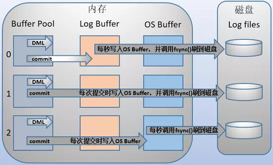
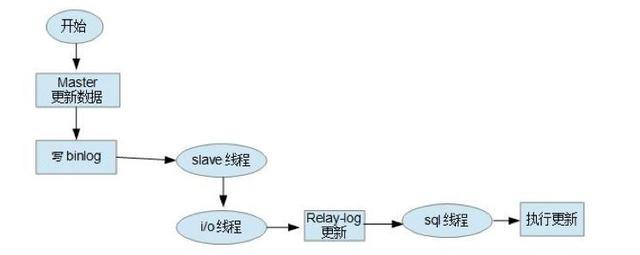
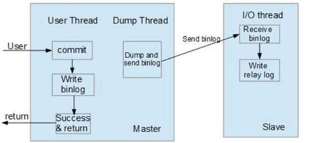
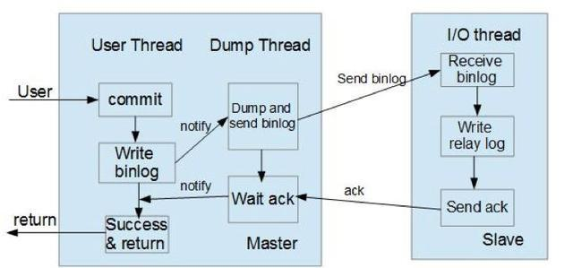

## MySQL 日志

MySQL 中有六种日志文件, 分别是: 重做日志(redo log), 回滚日志(undo log), 二进制日志(binlog),
错误日志(errorlog), 慢查询日志(slow log), 一般查询日志(general log), 中继日志(relay log).

其中 `重做日志` 和 `回滚日志` 与事务操作息息相关, `二进制日志` 也与事务操作有一定的关系.


### 重做日志 (redo log)

- 作用 

确保事务的持久性.

防止在发生故障的时间点, 尚有脏页面未写入磁盘, 在重启MySQL服务的时候, 根据redo log进行重做, 从而达到
事务的持久性这一特性.

- 内容

`物理格式的日志`, 记录的是 `物理数据页面的修改信息`, 其 redo log 是顺序写入redo log file的物理文
件中去的.

redo log包含两部分:
一是内存中的日志缓冲(redo log buffer), 该部分日志是易失性的; 
二是磁盘上的重做日志文件(redo log file), 该部分日志是持久的.

在概念上, InnoDB 通过 `force log at commit` 机制实现事务的持久性, 即在事务提交的时候, 必须先将事
务的所有事务日志写入到磁盘上的 redo log file 和 undo log file中进行持久化.

为了确保每次日志都能写入到事务日志文件中, 在每次将 log buffer的日志写入到日志文件的过程中都会调用一次
fsync操作. 因为MySQL工作在用户空间, MySQL的log buffer处于用户空间的内存中. 要写入到磁盘上的log file
(redo: ib_logfileN文件, undo: ibdataN 或 .ibd文件) 当中, 中间还要经过操作系统内核空间os buffer,
调用 fsync 的作用就是将 OS buffer中的日志刷到磁盘的log file中.




- 日志块 (log block)

InnoDB 存储引擎当中, redo log 以块为单位进行存储的, 每个块占 512 字节, 这称为redo log bolck. 所以不管
是`log buffer`中, `os buffer`中 以及 `redo log file on disk`中, 都是以这样512字节的块存储的.

每个 `redo log block` 由3部分组成: **日志块头, 日志块尾, 日志主体**. 其中日志块头占用12字节, 日志块尾
占用4字节, 因此日志主体只有496字节.


由于redo log记录的是数据页的变化, 当一个数据页产生的变化需要使用超过496字节redo log来记录, 那么记忆会使用
多个redo log block来记录数据页的变化.

日志块头:
```
log_block_hdr_no: (4字节), 该日志块在redo log buffer中的位置ID

log_block_hdr_data_len: (2字节), 该log block中已经记录的log大小. 写满该log block时为0x200, 表示
512字节.

log_block_first_rec_group: (2字节) 表示该log block中作为第一个新的mtr开始log record的偏移量. 如果
一个mtr日志横跨多个log block时, 只设置最后一个 log block.

log_block_checkpoint_no: (4字节) 写入检查点信息的位置
```
关于 log_block_first_rec_group, 因为有时候一个数据页产生的日志量超出一个日志块, 那么需要用多个日志块来
记录该页的相关日志. 例如, 某一个数据页产生552字节的日志量, 需要两个日志块, 第一个日志块占用492字节, 第二个
日志块占用60字节. 对于第二个日志块来说, 它的第一个log开始的位置就是73字节 (60+12). 如果该部分值和 
log_block_hdr_data_len 相等, 则说明该log block中没有新开始的日志块, 即表示该日志块延续了前一个日志块.


日志块尾:
```
log_block_checksum, 该log block计算出的校验值
```

- 日志文件结构

每个日志文件组的第一个文件的前2048字节是存放的头文件信息. 



日志文件头共占用4个OS_FILE_LOG_BLOCK_SIZE(512字节)的大小. 

```
LOG_GROUP_ID, (4字节) 该log文件所属的日志组
LOG_FILE_START_LSN, (8字节), 该log文件记录的开始日志的lsn
LOG_FILE_WAS_CREATED_BY_HOT_BACKUP, (32字节), 备份程序所占用的字节数

LOG_CHECKPOINT_1/LOG_CHECKPOINT_2, (512字节) 两个记录InnoDB checkpoint信息的字段, 分别从文件头的第二个
和第四个 log block 开启记录. 只使用日志文件组的第一个日志文件
```

- redo log的格式

因为InnoDB存储引擎存储数据的单元是页, 所以redo log也是基于页的格式记录的. 默认情况下, InnoDB的页大小是16KB(
由innodb_page_size设置) 一个页内可以存储非常多的log block(512字节), 而log block中记录的又是数据页的变化.

其中 log block 中的 496 字节部分是log body, 该body的格式分为4部分:

```
redo_log_type: (1字节), 表示redo log的日志类型

space: 表示空间ID, 采用压缩的方式后, 占用空间可能小于4字节

page_no: 页的偏移量, 同样进行压缩过的.

redo_log_body: 表示每个redo log的数据部分, 恢复时调用相应的函数进行解析.
```

- 产生时间

事务开始之后就会产生redo log, redo log 落盘并不是随着日志的提交才写入的, 而是在事务的执行过程中, 便
开始写入redo log文件中.

之所以说重做日志是在事务开始之后逐步写入重做日志文件, 而不一定是事务提交才写入重做日志文件, 原因是: 重做
日志有一个缓存区innodb_log_buffer, 其默认的大小是 16M, InnoDB 存储引擎先将重做日志写入innodb_log_buffer
中.


InnoDB redo log 刷盘的规则:

1) 发出commit动作时. commit发出后是否刷日志由变量 `innodb_flush_log_at_trx_commit` 控制

2) 每秒刷一次. 这个刷日志的频率由变量 `innodb_flush_log_at_timeout`值决定, 默认是1秒.

3) 当log buffer中已经使用的内存超过一半时.

4) 当有checkpoint时, checkpoint在一定程度上代表了刷到磁盘时日志所处的LSN位置.

[掘金文档](https://juejin.im/entry/5ba0a254e51d450e735e4a1f)

[Segment文档](https://segmentfault.com/a/1190000017888478)

[淘宝文档](http://mysql.taobao.org/monthly/2015/05/01/)

内存中 (buffer pool)未刷到磁盘的数据称为脏数据(dirty data). 由于数据和日志都页的形式存在, 所以脏页
表示脏数据和脏日志.

在InnoDB中, 数据刷盘的规则只有一个, checkpoint. 但是触发checkpoint的情况却有几种. 不管怎样, checkpoint
触发后, 会将buffer中数据页和脏日志都刷到磁盘.

InnoDB中的checkpoint分为两种:

a) sharp checkpoint: 在重用redo log文件(例如切换日志文件)的时候,会将所有已记录到redo log中对应的
脏数据刷到磁盘.

b) fuzzy checkpoint: 一次只刷一小部分的日志到磁盘, 而非将所有脏日志刷盘. 有以下几种情况会触发该检查
点:

master thread checkpoint: 由master线程控制, 每秒或每10秒刷入一定比例的脏页到磁盘.

flush_lru_list checkpoint: 从MySQL 5.6开始, 可以通过 innodb_page_cleaners 变量指定专门负责
脏页刷盘的page cleaner线程的个数, 该线程的目的是为了保证lru列表有可用的空闲页.

aysnc/sync flush checkpoint: 同步刷盘还是异步刷盘. 如果有非常多的脏页没刷到磁盘(有比例控制),这个
时候会选择同步刷到磁盘, 但是很少出现; 如果脏页不是很多, 可用选择异步刷到磁盘, 如果脏页很少, 可用暂时不
刷脏页到磁盘.

dirty page too much checkpoint: 脏页太多时强制触发检查点. 目的是为了保证缓存有足够的空闲空间. too
much的比例由变量 innodb_max_dirty_pages_pct 控制, MySQL 5.6 以后默认值是 75, 即当脏页站缓冲池的
百分之75后, 强制刷一部分脏页到磁盘.


- 对应的物理文件

默认情况下, 对应的物理文件位于数据库 data 目录下的 `ib_logfile1` 和 `ib_logfile2`.

innodb_log_group_home_dir 指定日志文件组所在的路径, 默认是 ./ , 表示在数据库的数据目录下.

innodb_log_files_in_group 指定重做日志文件组中的文件数量, 默认是 2

innodb_log_file_size 重做日志文件的大小, 默认值是 512MB

innodb_log_buffer_size 重做日志文件缓存区 `innodb_log_buffer` 的大小, 默认是 16M

innodb_flush_log_at_trx_commit=1, 指定了 `InnoDB` 在事务提交后的日志写入频率. 
````
值设置为 `0`, 每隔1秒log buffer刷到文件系统(os buffer)去, 并且调用文件系统的"flush"操作将缓存刷新到磁
盘上去. 也就是说一秒前的日志都保存到log buffer, 也就是内存上, 也就是 log buffer 的刷新操作和事务提交操作
没有关联. 在这种情况下, MySQL性能最好. 如果mysqld进程崩溃, 通常导致最后1s的日志丢失.

值设置为 `1`, 每次事务提交, log buffer 会被写入到文件系统中(os buffer)去, 并且调用文件系统的"flush"操
作将缓存刷新到磁盘上去. 这个是默认值. 效率最慢. 

值设置为 `2`, 每次事务提交, log buffer 会被写入到文件系统中(os buffer)去, 但是每隔1秒调用文件系统(os buffer)
的"flush"操作将缓存刷新到磁盘上去. 这时如果mysqld进程崩溃, 由于日志已经写入到系统缓存, 所以并不会丢失数据; 
在操作系统崩溃的情况下, 通常会导致最后1s的日志丢失. 这里的 "1秒" 是可以使用 `innodb_flush_log_at_timeout`
来控制时间间隔的
````



innodb_flush_log_at_timeout=1, 指定了 `InnoDB` 日志由系统缓存刷写到磁盘的时间间隔. 默认值是1s


### 回滚日志 (undo log)


[淘宝文档](http://mysql.taobao.org/monthly/2015/04/01/)

- 作用

保存了事务发生之前的数据的一个版本, 可以用于事务回滚, 同时可以提供多版本并非控制下的读(MVCC), 即
非锁定读.


- 内容

`逻辑格式的日志`, 在执行undo的时候, 仅仅是将数据从逻辑上恢复至事务之前的状态, 而不是从物理层面上操作
实现的, 这一点不同于 redo log


- 产生的时间

当事务提交之后, undo log 并不能立马被删除, 而是放入待清理的链表, 由 `purge` 线程判断是否有其它
的事务在使用 undo 段中表的上一个事务之前的版本信息, 决定是否可以清理undo log的日志空间.


- 对应的物理文件

MySQL 5.6 之前, undo 表空间位于共享表空间的回滚段中, 共享表空间的默认名称是 ibdata, 位于数据文
件目录中.

MySQL 5.6 以后, undo 表空间可以配置成独立的文件, 但是提前需要在配置文件中配置, 完成数据库初始化
之后生效且不能改变undo log文件的个数.

MySQL 5.7 之后undo表空间配置参数如下:

innodb_file_per_table=ON, 表示为数据库的每张表使用独立的表空间, 数据库的每个表使用一个单独的 '.ibd'
文件存储数据和索引. 默认值是ON. 如果是 OFF, 数据库的所有数据和索引都存储在 `ibdata` 文件当中 

> 修改这个系统变量并不能带来性能提升. 

innodb_undo_directory  undo独立表空间的存放目录, 默认是 ./

innodb_undo_logs   回滚段为大小(KB), 默认是128KB

innodb_undo_tablespaces 指定undo log文件个数, 默认是0

innodb_max_undo_log_size 指定undo log文件最大的大小, 默认是1G


如果undo使用共享表空间, 这个共享表空间中不仅仅是存储了undo的信息. 默认的目录是 ./

innodb_data_file_path  文件路径,大小配置, "ibdata1:1G:autoextend"


- 其他

undo 是事务开始之前的保存的被修改的数据的一个版本, 产生undo日志的时候, 同样会伴随类似于保护事务持久化
机制的redo log的产生.

默认情况下, undo文件是保持在共享表空间的, 即ibdata文件当中, 当数据库中发生一些大的事务性操作的时候, 
要产生大量的undo信息, 全部保存在共享表空间中.

因此, 共享表空间可能会变得很大, 默认情况下, 也就是undo日志使用共享表空间的时候, 被 "撑大" 的共享表空间
是不会自动收缩的.


### 二进制日志 (binlog)

- 作用

用于复制, 在主从复制中, 从库利用主库上的binlog进行重播, 实现主从同步.

用于数据库基于时间点的还原.


- 内容

`逻辑格式的日志`, 可以简单的认为就是执行过过的事务中的sql语句. 但又不完全是sql语句这么简单, 而且包含了
执行的sql语句(增删改)反向的信息.

也就意味着 `delete` 对应着 `delete` 本身和其反向的 `insert`; `update` 对应着 `update` 执行前后
的版本信息; `insert` 对应着 `insert` 本身和其反向的 `delete`.

在使用 mysqlbinlog 解析 binlog 会展示相关情况.


- 产生时间

事务提交的时候, 一次性将事务中的 `sql` 语句(一个事务可能对应多个sql语句)按照一定的格式记录到binlog当中.

这里与 redo log 明显的差异是 redo log 是在事务开始之后就开始逐步写入磁盘. 

在开启了bin log 的情况下, 对于较大事务的提交, 可能会变得比较慢一些.


- 删除时间

binlog 的默认保存时间由参数 expire_logs_days 配置, 也就是说对于非活动的日志文件, 在生成时间超过 `expire_log_days`
配置的天数之后, 会被自动删除.  默认值是0, 表示永不过期


- 对应的物理文件

配置文件的路径 `log_bin_basename`, binlog文件按照指定的大小, 当日志文件达到指定的最大的大小之后, 进行
滚动更新, 生成新的日志文件.

log_bin={OFF|/tmp/binlog}, 开启bin log, 并且设置binlog的路径, 文件格式 binlog.xx

binlog_format={ROW|STATEMENT|MIXED}, bin log的格式. 

```
ROW: 仅保存记录被修改的细节, 不记录sql语句上下文相关信息. 优点, 清晰的记录下每一行数据的修改细节, 不需要记录上
下文相关信息, 因此不会发生某些特定情况下的produce, function,trigger的调用无法被正确复制的问题, 任何情况下都
可以被复制, 且 `能加快从库重放的效率`, 保证从库数据的一致性. 缺点, 由于所有执行的语句在日志中都将以每行记录的修
改的修改细节来记录, 因此, 可能产生大量的日志内容. `alter table`, `update`等

STATEMENT: 每一条被修改的数据SQL都会记录在binlog中. 优点, 只需要**记录执行语句的细节和上下文环境**, 避免了记
录每一行的变化, 在一些修改记录较多的情况下相比ROW能减少binlog的日志量, 节约IO. 可用于实时的还原. 主从版本可以不
一样. 缺点, 为了保证SQL语句能在slave上正确执行, 必须记录上下文信息, 以保证所有语句能在slave得到和master端执行
时候相同的结果. 主从复制, 存在部分函数(如sleep)以及存储过程在slave上会出现与master不一致的情况.

MIXED:以上两种格式的混合使用.
```

log_bin_index=/tmp/binlog.index  指定binlog索引文件(保存了当前所有的binlog文件名)的名称               

binlog_cache_size=3M, 指定binlog的缓存大小

max_binlog_size=12M, 指定单个binlog文件的最大size

max_binlog_cache_size=16M, 指定binlog的最大缓存大小                     

sync_binlog={0|N}, MySQL的二进制日志(bin log)同步到磁盘的频率.
```
值为 `0`, 表示当事务提交之后, MySQL不做fsync之类的磁盘同步操作, 而让fs自行决定什么时候做同步; 

值为 `N`, 表示每进行N次事务提交之后, MySQL将进行一次fsync之类的磁盘同步指令将binlog_cache当中的数据
强制写入到磁盘. 

在MySQL中默认的设置是 `sync_binlog=0`, 不强制磁盘刷新, 性能最好, 风险是最大的. 而 `sync_binlog=1`
是最安全但是性能损耗最大的设置.

注: 如果autocommit开启, 每个语句都写一次bin log, 否则每次事务写一次.
```


- 其他

binlog 的作用之一是还原数据库的, 这与redo log 类似, 但是这两者有本质的不同:

a) 作用不同: redo log是保证事务的持久性的, 是事务层面的; bin log 作为还原功能, 是数据库层面的(当然可以
精确到事务层面的).

b) 内容不同: redo log是物理日志,是数据页面的修改之后的物理记录; binlog是逻辑日志, 可以简单的认为记录的
就是sql语句

c) 恢复数据时候的效率, 基于物理日志的redo log恢复的效率要高于语句逻辑日志的binlog

关于事务提交时, redo log和binlog的写入顺序, 为了保证主从复制时候的主从一致(的\包括使用binlog进行基于时
间点还原的情况), 是严格一致的.

MySQL通过两阶段提交过程完成事务的一致性的, 即 redo log 和 binlog 的一致性, 理论上先写入 redo log, 再
写入binlog, 两个日志都写入成功(写入磁盘), 事务才算真正的完成.


### 错误日志 (err log)

错误日志记录着mysqld启动和停止, 以及服务器运行过程中发生的错误和严重的警告的相关信息. 在默认情况下, 系统记录
错误日志的功能是关闭的, 错误信息被输出标准错误输出.

指定错误日志路径的方法:

log_error=/path/to/error, 配置文件my.cnf


### 一般查询日志 (general log)

记录了服务器接收到每一个 `命令`, 无论这些命令是否正确甚至是否包含语法错误, general log都会将其记录下来, 记录
的格式为: {Time, Id, Command, Argument}

也正是因为mysql服务器需要不断的记录日志, 开启general log会产生不小的系统开销. 因此, 默认是把 general log
关闭的.

> general log 记录的是服务器执行的所有的命令 

general log相关的参数:

general_log=ON, 开启general log

general_log_file=/tmp/general.log, 设置general log文件位置

log_output={FILE|TABLE}, 设置general log的格式, FILE表示记录到文件当中, TABLE表示记录到general_log
表(mysql.general_log)当中, 表的默认引擎的CSV. 


### 慢查询日志(slow log), 分析优化SQL语句

MySQL 的慢查询日志是 MySQL 提供的一种日志记录,它用来记录在 MySQL 中 `响应时间` 超过阀值的语句, 具体指运行时间
超过 `long_query_time`值的SQL, 则会被记录到慢查询日志. 默认值是10s. 默认情况下, 不开启慢查询日志.

> 慢查询日志记录是响应时间超过阈值的所有的SQL语句(包括select, insert, update, delete)

slow_query_log=ON, 开启慢查询

long_query_time=2.00, 慢查询的时间

slow_query_log_file=/tmp/slow_query.log, 慢查询日志文件路径

log_queries_not_using_indexes=ON, `未使用索引的查询` 也被记录到慢查询日志中(可选项)

log_output={FILE|TABLE}, 设置query log的格式, FILE表示记录到文件当中, TABLE表示记录到slow_log
表(mysql.general_log)当中, 表的默认引擎的CSV. 


日志文件的格式:

```
# Time: 2020-05-05T12:17:33.123438Z  (时间信息)
# User@Host: root[root] @ localhost [127.0.0.1]  Id:    15  (连接信息)
# Query_time: 0.000184  Lock_time: 0.000090 Rows_sent: 4  Rows_examined: 4  (查询响应信息)
SET timestamp=1588681053; (时间点)
select * from t2; (语句)
```

### 中继日志 (relay log)

与 bin log一样, relay log 由一组编号的 files 和 一个索引文件组成, 这些files包含描述数据库更改的 events,
索引文件包含所有使用的relay log files的名称.

relay log 具有和bin log相同的格式. 可以使用 mysqlbinlog 进行读取.

从服务器在以下的条件下创建新的relay log文件:

1) 每个 time线程开始

2) 刷新日志(例如, 使用 flush logs 或 mysqladmin flush-logs)

3) 当前relay log文件的大小变得"太大"时, 确定如下:

a) 如果 max_relaylog_size 的值大于0, 那么这是最大的 relay log文件大小

b) 如果 max_relaylog_size 的值是0, 那么 max_binlog_size 确定最大 relay log文件大小

SQL 线程在执行文件中的所有 events 并且不再需要它之后自动删除每个 relay log文件. 没有明确的删除 relay log
文件的机制, 因为 SQL 线程负责这样做. 但是, FLUSH LOGS 会轮换(rorate) relay log, 这会影响 SQL 线程同时
删除它们.


相关的参数:

relay_log=/tmp/relaylog, 开启relay log, 并设置文件的路径

relay_log_index=/tmp/relaylog.index, 设置relay log的索引文件.

relay_log_info_file=/tmp/relaylog.info, 设置relay log info文件(记录master的bin_log的恢复位置和
relay_log的位置)的位置和名称, 也可以配置记录到mysql.slave_relay_log_info表中.

relay_log_info_repository={TABLE|FILE}, 设置relay log info的格式, FILE表示记录到文件当中, TABLE
表示记录到表(mysql.slave_relay_log_info)当中, 表的默认引擎的CSV. 


max_relaylog_size=1G, relay log单个文件的最大值. 如果该值是0, 则默认值是max_binlog_size


relay_log_purge=ON, 是否自动清空不再需要的 relay log, 默认值是ON

relay_log_recovery=OFF, 当slave宕机之后, 假如relay log出现损坏, 导致一部分中继日志没有处理, 则自动放
弃所有未执行的 relay log, 并且重新从 master 上获取日志, 这样就保证了relay log的完整性. 默认情况下, 该功
能是关闭的.

> 注意, 开启 `relay_log_recovery` 功能的时候, 记得开启 `relay_log_purge`

sync_relay_log=1000, 此参数和 sync_binlog 是一样的, 当设置为1时, slave的I/O线程每次接收到master发送过来
的bin log都要写入系统缓存区, 然后耍人relay log文件当中, 这样是最安全的, 因为在崩溃的时候, 最多丢失一个事务, 但
会造成磁盘大量I/O. 当设置为0时, 并不是马上刷入到relay log文件当中, 而是由操作系统决定何时写入, 虽然安全性降低,
但减少了大量的磁盘I/O操作. 默认值是1000

sync_relay_log_info=1000, 和sync_relay_log参数一样. 


## MySQL 复制

### MySQL 主从原理

MySQL 的 Replication 是一个复制的过程(MySQL5.1.7以上版本分为异步复制和半同步复制两种模式), 从一个 MySQL
instance (master) 复制到另一个MySQL instance (slave). 在master 和 slave之间的实现整个复制过程主要有
三个线程完成. 其中两个线程(SQL线程和IO线程)在slave端, 另外一个线程(dump线程)在master端.

要实现MySQL的Replication, 首先必须打开master的 bin log功能, 否则无法实现. 因为整个复制过程实际上就是slave
从master端获取该日志, 然后再在自己身上顺序执行日志中所记录的各种操作. 

### 复制过程


- 主节点 bin log dump 线程

当从节点连接主节点时, 主节点会创建一个 dump 线程, 用于发送bin-log的内容.在读取bin-log中的操作时, 此线程
会对主节点上的bin-log加锁, 当读取完成, 甚至在发动给从节点之前, 锁会被释放.


- 从节点I/O线程

当从节点上执行 `start slave` 命令之后, 从节点会创建一个I/O线程用来连接主节点, 请求主库中更新的bin-log. 
I/O线程接收到主节点 binlog dump 进程发来的更新之后, 保存在本地relay-log中.


- 从节点SQL线程

SQL线程负责读取relay log中的内容, 解析成具体的操作并执行, 最终保证主从数据的一致性.

对于每一个主从连接, 都需要三个线程来完成. 当主节点有多个从节点时, 主节点会为每一个当前连接的从节点建
一个binary log dump 线程, 而每个从节点都有自己的I/O线程, SQL线程. 从节点用两个线程将从主库`拉取
更新` 和 `执行` 分成独立的任务, 这样在执行同步数据任务的时候, 不会降低读操作的性能. 

比如, 如果从节点没有运行, 此时I/O进程可以很快从主节点获取更新, 尽管SQL进程还没有执行. 如果在SQL进程
执行之前从节点服务停止, 至少I/O进程已经从主节点拉取到了最新的变更并且保存在本地relay日志中, 当服务再
次起来之后, 就可以完成数据的同步.




- 从节点上的I/O线程连接到主节点, 并请求从指定日志文件的指定位置(或者从最开始的日志)之后的日志内容;

- 主节点接收到来自从节点的I/O请求后, 通过负责复制的dump线程根据请求信息读取指定日志指定位置之后的日志
信息, 返回给从节点. 返回信息中除了日志所包含的信息之外, 还包括本次返回的信息的bin-log file以及bin-log
position; 从节点是I/O线程接收到内容后, 将接收到的日志内容更新到本机的relay log中, 并将读取到的 bin
log 文件名和位置保存到master-info文件中, 以便下一次读取具体的内容

- slave的SQl线程检测到relay log中新增加了内容后, 会将relay log的内容解析成和master节点上实际执行过
的操作, 并在本地数据库当中执行.


### 复制格式(binlog的三种记录模式)

a) 基于SQL语句的复制(SBR), 默认

b) 基于行的复制(RBR)

c) 混合模式复制(MBR)

SBR: 

```
优点:
历史悠久,技能成熟; binlog文件较小;可用于实时的还原, 而不仅仅用于复制

缺点:
1. 不是所有的UPDATE语句都能被复制, 尤其是包含不确定操作的时候;
2. 调用具有不确定因素的UDF(procedure, function, trigger等)时复制可能出现问题;
3. 使用以下函数的语句不能被复制:
LOAD_FILE()
UUID()
USER()
FOUND_ROWS()
SYSDATE()
```

RBR:
```
优点:
1. 任何情况下都可以被复制, 这对于复制来说是最安全可靠的
2. 复制以下几种语句时行锁更少:
- INSERT ... SELECT
- 包含 AUTO_INCREMENT 字段的 INSERT
- 没有附带条件或者没有修改很多记录的UPDATE或DELETE语句
3. 执行INSERT, UPDATE, DELETE语句时锁更少
4. 从服务器上采用多线程来执行复制成为可能


缺点:
1. binlog大了很多
2. 复杂的回滚时 binlog 中包含大量的数据
3. 主服务器上执行UPDATE语句时, 所有发生改变的记录都会写入到binlog中, 而SBR只写一次
4. UDF产生的大BLOB值导致复制变慢
5. binlog 进行加密
```

> 如果采用INSERT, UPDATE, DELETE 直接操作表的情况，则日志格式根据binlog_format的设定而记录

> 如果采用GRANT, REVOKE, SET PASSWORD等管理语句来做的话, 那么无论如何都采用SBR模式记录


### 同步模式

- 异步模式(async-mode)

这种模式, 主节点不会主动push bin log到从节点, 这样可能导致failover的情况下, 也许从节点没有及时地
将最新的bin log同步到本地.



- 半同步模式(semi-mode)

这种模式, 主节点只需要收到其中一台从节点的返回信息, 就会commit; 否则需要等待直到超时时间然后切换成
异步模式再提交; 这样做的目的可以使主从数据库的数据延迟缩小, 可以提高数据安全性, 确保了事务提交后,
binlog至少传输到了一个从节点上, 不能保证从节点将此事务更新到db中. 性能上会有一定的降低, 响应时间会
变长.




- 全同步模式

这种模式, 主节点和从节点全部执行了commit并确认才会向客户端返回成功.

- GTID复制模式

@ 在传统的复制里面, 当发生故障, 需要主从切换, 需要找到binlog和pos点, 然后将主节点指向新的主节点, 相对来说
比较麻烦, 也容易出错. 在MySQL5.6 里面, 不用再找binlog和pos点, 只需要知道主节点的ip, port 以及账号密码
就行, 因为复制是自动的, MySQL会通过内部机制GTID自动找点同步.

@ 多线程复制, 在MySQL5.6之前, slave的复制是单线程的. 一个事件一个事件的读取应用. 而master是并发写入的,
所以延时是避免不了的. 唯一有效的方法是把多个db放在多台slave, 这样有点浪费服务器. 在MySQL5.6, 可以把多个
表放在多个库, 这样就可以使用多线程复制.

基于GTID复制实现原理:

1) 主节点更新数据, 会在事务前产生GTID, 一起记录到binlog日志中.

2) 从节点是I/O线程将变更的bin log, 写入到本地的relay log中.

3) SQL线程从relay log中获取GTID, 然后对比本地binlog是否记录, (MySQL从节点必须要开启bin log)

4) 如果记录, 说明该GTID的事务已经执行, 从节点会忽略.

5) 如果没有记录, 从节点就会从 relay log中执行该GTID的事务, 记录到bin log

6) 在解析过程中会判断是否包含有主键, 如果没有就使用二级索引, 如果还没有就用全部扫描


## 主从复制关键点

- master 节点创建数据同步的账号, 授予 `REPLICATION SLAVE`, `REPLICATION CLIENT` 权限

```mysql
CREATE USER 'slave'@'%' IDENTIFIED BY 'password';
GRANT REPLICATION SLAVE,REPLICATION CLIENT ON *.* TO 'slave'@'%' IDENTIFIED WITH 
mysql_native_password BY 'password';
```

- master 开启binlog, slave开启relaylog, 设置各自的 `server-id` 属性

- slave 设置master的信息, 并连接master(**很关键**).

```
> change master to master_host='172.17.0.2', master_user='slave', master_password='password',
master_port=3306, master_log_file='', master_log_pos=10, master_connect_retry=30;
```

**CHNAGE MASTER TO**
```
CHANGE MASTER TO [options]

master_host: master地址
master_port: master端口
master_user: slave复制的user
master_password: slave复制的用户密码

master_log_file: 指定slave从哪个bin log开始复制数据, `show master status` File的值
master_log_pos: 指定从哪个Position开始读, 即上文 Position 字段的值

master_connect_retry: 如果连接失败, 重试的时间间隔, 单位是秒, 默认60
master_heartbeat_period: 心跳周期
master_retry_count: 重试的次数, 默认值是86400

slave_net_timeout系统变量指定slave在等待master '发送数据' 或 '心跳信号' 的秒数. 一旦超出, slave会认为
当前的连接已经中断, 终止读取, 并尝试重新连接. 默认值为60秒. 在MySQL 5.7.7之前, 默认值为3600秒.

心跳间隔由MASTER_HEARTBEAT_PERIOD选项控制, 该间隔将在没有数据的情况下停止connection timeout(如果连接仍
然良好). 在该秒数之后, 心跳信号将发送到slave, 并且每当master的bin log更新的时候, 会重置等待时间. 因此, 仅
当bin log文件中没有未发送事件的时间超过此时间时, master才会发送心跳. 心跳间隔的默认值是slave_net_timeout
系统变量的一半.

注意, 更改slave_net_timeout的值或默认设置不会自动更改心跳间隔.

MASTER_CONNECT_RETRY指定两次重试之间的间隔, 而MASTER_RETRY_COUNT则限制重试的次数.


master_delay: 滞后的master的时间间隔

MASTER_DELAY指定slave必须滞后于master多少秒. 从master接收到的事件要比在master上执行的事件晚至少间隔几秒才执
行. 缺省值为0. 如果interval不是0到231-1范围内的非负整数, 则会发生错误.
```

- 开启主从复制(**很关键**)

```
> START SLAVE;
```

- 其他

```
STOP SLAVE IO_THREAD; // 停止IO线程

STOP SLAVE SQL_THREAD; // 停止SQL线程
CHANGE REPLICATION FILTER REPLICATE_DO_DB=(); // 更新RELICATION的db集合
START SLAVE SQL_THREAD; // 启动SQL线程
```

**CHANGE REPLICATION FILTER**
```
CHANGE REPLICATION FILTER [options]

REPLICATE_DO_DB=(db_list)
REPLICATE_IGNORE_DB=(db_list)

REPLICATE_DO_TABLE=(tb_list)
REPLICATE_IGNORE_TABLE=(tb_list)

REPLICATE_REWRITE_DB=(db_pair_list)

db_list: db_name [, db_name] [, db_name]
tb_list: tb_name [, tb_name] [, tb_name]
db_pair_list: (from_db, to_db) [, (from_db, to_db)]


REPLICATE_DO_DB: 包括基于数据库名称的更新.
REPLICATE_IGNORE_DB: 排除基于数据库名称的更新.

REPLICATE_DO_TABLE: 包括基于表名称的更新.
REPLICATE_IGNORE_TABLE: 排除基于表名的更新.

REPLICATE_REWRITE_DB: 在slave上用新名称替换master上的指定数据库后, 在slave上执行更新.
```

- 主从复制的全局变量

```
slave_net_timeout, 决定了 master_connect_retry, 和 master_heartbeat_period 的默认值

sql_slave_skip_counter, 出现故障, sql跳过的个数. 默认是0
slave_skip_errors, 可以忽略的错误
```

- 半同步操作

1.安装插件

```
master:
> INSTALL PLUGIN rpl_semi_sync_master SONAME 'semisync_master.so';

slave:
> INSTALL PLUGIN rpl_semi_sync_slave SONAME 'semisync_slave.so';
```

2.查看插件, 并启用插件

```
> show plugins;

master:
> set global rpl_semi_sync_master_enabled=1;

slave:
> set global rpl_semi_sync_slave_enabled=1
```

3.重启slave的IO线程, 查看状态

```
slave:
> STOP SLAVE IO_THREAD
> START SLAVE  IO_THREAD
```
