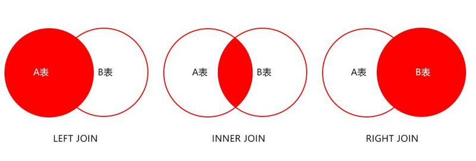
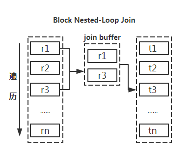

# mysql 性能优化

- 区分in和exists, not in 和 not exists

```mysql
SELECT * FROM t1 WHERE id IN (SELECT id FROM t2);

SELECT * FROM t1 WHERE EXISTS(SELECT * FROM t2 WHERE t2.id=t1.id);
```

```
区分in和exists主要造成驱动顺序的改变(性能变化的关键), 如果是exists, 那么以外层表为驱动表, 先被访问.
如果是in, 那么先执行子查询. 所以in适合于外表大而内表小的情况; exist适合外表小而内表大的情况.
```

```
关于not in 和 not exists, 推荐使用not exists, 不仅仅是效率问题, not in可能存在逻辑的问题.
```

```mysql
SELECT colname FROM t1 WHERE t1.id NOT IN (SELECT t2.id FROM t2);

SELECT colname FROM t1 LEFT JOIN t2 ON t1.id=t2.id AND t2.id IS NULL; # 高效
```

- LIKE 语句的优化

```
name LIKE {name}% 优化:
name >= {name} AND name < {name}
```

```
name LIKE %{name}% 或 name LIKE %{name}% 优化:

使用全文索引.
创建:
ALTER TABLE `t1` ADD FULLTEXT INDEX `idx_name` (`name`);
使用: 
MATHCH(name) against('{name}' in boolean mode)
```

- JOIN 优化



```
LEFT JOIN A表为驱动表
INNER JOIN MySQL会自动找出那个数据少的表作用驱动表
RIGHT JOIN B表为驱动表
```

```
尽量使用 INNER JOIN, 避免使用LEFT JOIN.
参与联合查询的表至少为2张表, 一般都存在大小之分. 如果连接方式是INNER JOIN, 在没有其他过滤条件的情况下
MySQL会自动选择小表作为驱动表, 但是LEFT JOIN在驱动表的选择上遵循的是左边驱动右边的原则, 即LEFT JOIN
左边的表名为驱动表.

尽量使用被驱动表的索引字段作为on的限制字段.
```

小表驱动大表



巧用 STRAIGHT_JOIN

```
inner join是由mysql选择驱动表, 但是有些特殊情况需要选择另个表作为驱动表, 比如有group by, order by等
「Using filesort」, 「Using temporary」 时. 使用STRAIGHT_JOIN来强制连接顺序, 在STRAIGHT_JOIN左边的表
名就是驱动表, 右边则是被驱动表. 在使用STRAIGHT_JOIN的前提条件是该查询是内连接, 即inner join. 其他连接不
推荐使用STRAIGHT_JOIN, 否则可能造成查询结果不准确.

STRAIGHT_JOIN t ON ...
```