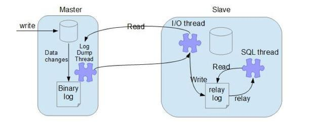
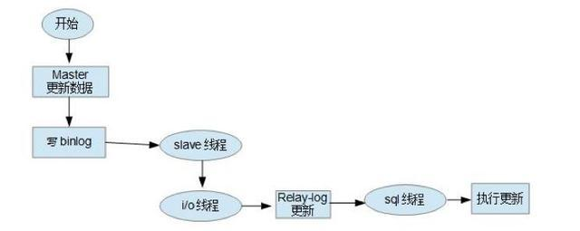
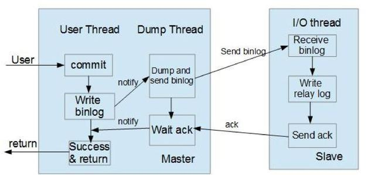

## MySQL 复制

### MySQL 主从原理

MySQL 的 Replication 是一个复制的过程(MySQL5.1.7以上版本分为异步复制和半同步复制两种模式), 从一个 MySQL
instance (master) 复制到另一个MySQL instance (slave). 在master 和 slave之间的实现整个复制过程主要有
三个线程完成. 其中两个线程(SQL线程和IO线程)在slave端, 另外一个线程(dump线程)在master端.

要实现MySQL的Replication, 首先必须打开master的 bin log功能, 否则无法实现. 因为整个复制过程实际上就是slave
从master端获取该日志, 然后再在自己身上顺序执行日志中所记录的各种操作. 

### 复制过程




- 主节点 bin log dump 线程

当从节点连接主节点时, 主节点会创建一个 dump 线程, 用于发送bin-log的内容.在读取bin-log中的操作时, 此线程
会对主节点上的bin-log加锁, 当读取完成, 甚至在发动给从节点之前, 锁会被释放.


- 从节点I/O线程

当从节点上执行 `start slave` 命令之后, 从节点会创建一个I/O线程用来连接主节点, 请求主库中更新的bin-log. 
I/O线程接收到主节点 binlog dump 进程发来的更新之后, 保存在本地relay-log中.


- 从节点SQL线程

SQL线程负责读取relay log中的内容, 解析成具体的操作并执行, 最终保证主从数据的一致性.

对于每一个主从连接, 都需要三个线程来完成. 当主节点有多个从节点时, 主节点会为每一个当前连接的从节点建
一个binary log dump 线程, 而每个从节点都有自己的I/O线程, SQL线程. 从节点用两个线程将从主库`拉取
更新` 和 `执行` 分成独立的任务, 这样在执行同步数据任务的时候, 不会降低读操作的性能. 

比如, 如果从节点没有运行, 此时I/O进程可以很快从主节点获取更新, 尽管SQL进程还没有执行. 如果在SQL进程
执行之前从节点服务停止, 至少I/O进程已经从主节点拉取到了最新的变更并且保存在本地relay日志中, 当服务再
次起来之后, 就可以完成数据的同步.




- 从节点上的I/O线程连接到主节点, 并请求从指定日志文件的指定位置(或者从最开始的日志)之后的日志内容;

- 主节点接收到来自从节点的I/O请求后, 通过负责复制的dump线程根据请求信息读取指定日志指定位置之后的日志
信息, 返回给从节点. 返回信息中除了日志所包含的信息之外, 还包括本次返回的信息的bin-log file以及bin-log
position; 从节点是I/O线程接收到内容后, 将接收到的日志内容更新到本机的relay log中, 并将读取到的 bin
log 文件名和位置保存到master-info文件中, 以便下一次读取具体的内容

- slave的SQl线程检测到relay log中新增加了内容后, 会将relay log的内容解析成和master节点上实际执行过
的操作, 并在本地数据库当中执行.


### 复制格式(binlog的三种记录模式)

a) 基于SQL语句的复制(SBR), 默认

b) 基于行的复制(RBR)

c) 混合模式复制(MBR)

SBR: 

```
优点:
历史悠久,技能成熟; binlog文件较小;可用于实时的还原, 而不仅仅用于复制

缺点:
1. 不是所有的UPDATE语句都能被复制, 尤其是包含不确定操作的时候;
2. 调用具有不确定因素的UDF(procedure, function, trigger等)时复制可能出现问题;
3. 使用以下函数的语句不能被复制:
LOAD_FILE()
UUID()
USER()
FOUND_ROWS()
SYSDATE()
```

RBR:
```
优点:
1. 任何情况下都可以被复制, 这对于复制来说是最安全可靠的
2. 复制以下几种语句时行锁更少:
- INSERT ... SELECT
- 包含 AUTO_INCREMENT 字段的 INSERT
- 没有附带条件或者没有修改很多记录的UPDATE或DELETE语句
3. 执行INSERT, UPDATE, DELETE语句时锁更少
4. 从服务器上采用多线程来执行复制成为可能


缺点:
1. binlog大了很多
2. 复杂的回滚时 binlog 中包含大量的数据
3. 主服务器上执行UPDATE语句时, 所有发生改变的记录都会写入到binlog中, 而SBR只写一次
4. UDF产生的大BLOB值导致复制变慢
5. binlog 进行加密
```

> 如果采用INSERT, UPDATE, DELETE 直接操作表的情况，则日志格式根据binlog_format的设定而记录

> 如果采用GRANT, REVOKE, SET PASSWORD等管理语句来做的话, 那么无论如何都采用SBR模式记录


### 同步模式

- 异步模式(async-mode)

这种模式, 主节点不会主动push bin log到从节点, 这样可能导致failover的情况下, 也许从节点没有及时地
将最新的bin log同步到本地.


- 半同步模式(semi-mode)

这种模式, 主节点只需要收到其中一台从节点的返回信息, 就会commit; 否则需要等待直到超时时间然后切换成
异步模式再提交; 这样做的目的可以使主从数据库的数据延迟缩小, 可以提高数据安全性, 确保了事务提交后,
binlog至少传输到了一个从节点上, 不能保证从节点将此事务更新到db中. 性能上会有一定的降低, 响应时间会
变长.




- 全同步模式

这种模式, 主节点和从节点全部执行了commit并确认才会向客户端返回成功.

- GTID复制模式

@ 在传统的复制里面, 当发生故障, 需要主从切换, 需要找到binlog和pos点, 然后将主节点指向新的主节点, 相对来说
比较麻烦, 也容易出错. 在MySQL5.6 里面, 不用再找binlog和pos点, 只需要知道主节点的ip, port 以及账号密码
就行, 因为复制是自动的, MySQL会通过内部机制GTID自动找点同步.

@ 多线程复制, 在MySQL5.6之前, slave的复制是单线程的. 一个事件一个事件的读取应用. 而master是并发写入的,
所以延时是避免不了的. 唯一有效的方法是把多个db放在多台slave, 这样有点浪费服务器. 在MySQL5.6, 可以把多个
表放在多个库, 这样就可以使用多线程复制.

基于GTID复制实现原理:

1) 主节点更新数据, 会在事务前产生GTID, 一起记录到binlog日志中.

2) 从节点是I/O线程将变更的bin log, 写入到本地的relay log中.

3) SQL线程从relay log中获取GTID, 然后对比本地binlog是否记录, (MySQL从节点必须要开启bin log)

4) 如果记录, 说明该GTID的事务已经执行, 从节点会忽略.

5) 如果没有记录, 从节点就会从 relay log中执行该GTID的事务, 记录到bin log

6) 在解析过程中会判断是否包含有主键, 如果没有就使用二级索引, 如果还没有就用全部扫描


## 主从复制关键点

- master 节点创建数据同步的账号, 授予 `REPLICATION SLAVE`, `REPLICATION CLIENT` 权限

```mysql
CREATE USER 'slave'@'%' IDENTIFIED BY 'password';
GRANT REPLICATION SLAVE,REPLICATION CLIENT ON *.* TO 'slave'@'%' IDENTIFIED WITH 
mysql_native_password BY 'password';
```

- master 开启binlog, slave开启relaylog, 设置各自的 `server-id` 属性

- slave 设置master的信息, 并连接master(**很关键**).

```
> change master to master_host='172.17.0.2', master_user='slave', master_password='password',
master_port=3306, master_log_file='', master_log_pos=10, master_connect_retry=30;
```

**CHNAGE MASTER TO**
```
CHANGE MASTER TO [options]

master_host: master地址
master_port: master端口
master_user: slave复制的user
master_password: slave复制的用户密码

master_log_file: 指定slave从哪个bin log开始复制数据, `show master status` File的值
master_log_pos: 指定从哪个Position开始读, 即上文 Position 字段的值

master_connect_retry: 如果连接失败, 重试的时间间隔, 单位是秒, 默认60
master_heartbeat_period: 心跳周期
master_retry_count: 重试的次数, 默认值是86400

slave_net_timeout系统变量指定slave在等待master '发送数据' 或 '心跳信号' 的秒数. 一旦超出, slave会认为
当前的连接已经中断, 终止读取, 并尝试重新连接. 默认值为60秒. 在MySQL 5.7.7之前, 默认值为3600秒.

心跳间隔由MASTER_HEARTBEAT_PERIOD选项控制, 该间隔将在没有数据的情况下停止connection timeout(如果连接仍
然良好). 在该秒数之后, 心跳信号将发送到slave, 并且每当master的bin log更新的时候, 会重置等待时间. 因此, 仅
当bin log文件中没有未发送事件的时间超过此时间时, master才会发送心跳. 心跳间隔的默认值是slave_net_timeout
系统变量的一半.

注意, 更改slave_net_timeout的值或默认设置不会自动更改心跳间隔.

MASTER_CONNECT_RETRY指定两次重试之间的间隔, 而MASTER_RETRY_COUNT则限制重试的次数.


master_delay: 滞后的master的时间间隔

MASTER_DELAY指定slave必须滞后于master多少秒. 从master接收到的事件要比在master上执行的事件晚至少间隔几秒才执
行. 缺省值为0. 如果interval不是0到231-1范围内的非负整数, 则会发生错误.
```

- 开启主从复制(**很关键**)

```
> START SLAVE;
```

- 其他

```
STOP SLAVE IO_THREAD; // 停止IO线程

STOP SLAVE SQL_THREAD; // 停止SQL线程
CHANGE REPLICATION FILTER REPLICATE_DO_DB=(); // 更新RELICATION的db集合
START SLAVE SQL_THREAD; // 启动SQL线程
```

**CHANGE REPLICATION FILTER**
```
CHANGE REPLICATION FILTER [options]

REPLICATE_DO_DB=(db_list)
REPLICATE_IGNORE_DB=(db_list)

REPLICATE_DO_TABLE=(tb_list)
REPLICATE_IGNORE_TABLE=(tb_list)

REPLICATE_REWRITE_DB=(db_pair_list)

db_list: db_name [, db_name] [, db_name]
tb_list: tb_name [, tb_name] [, tb_name]
db_pair_list: (from_db, to_db) [, (from_db, to_db)]


REPLICATE_DO_DB: 包括基于数据库名称的更新.
REPLICATE_IGNORE_DB: 排除基于数据库名称的更新.

REPLICATE_DO_TABLE: 包括基于表名称的更新.
REPLICATE_IGNORE_TABLE: 排除基于表名的更新.

REPLICATE_REWRITE_DB: 在slave上用新名称替换master上的指定数据库后, 在slave上执行更新.
```

- 主从复制的全局变量

```
slave_net_timeout, 决定了 master_connect_retry, 和 master_heartbeat_period 的默认值

sql_slave_skip_counter, 出现故障, sql跳过的个数. 默认是0
slave_skip_errors, 可以忽略的错误
```

- 半同步操作

1.安装插件

```
master:
> INSTALL PLUGIN rpl_semi_sync_master SONAME 'semisync_master.so';

slave:
> INSTALL PLUGIN rpl_semi_sync_slave SONAME 'semisync_slave.so';
```

2.查看插件, 并启用插件

```
> show plugins;

master:
> set global rpl_semi_sync_master_enabled=1;

slave:
> set global rpl_semi_sync_slave_enabled=1
```

3.重启slave的IO线程, 查看状态

```
slave:
> STOP SLAVE IO_THREAD
> START SLAVE  IO_THREAD
```
