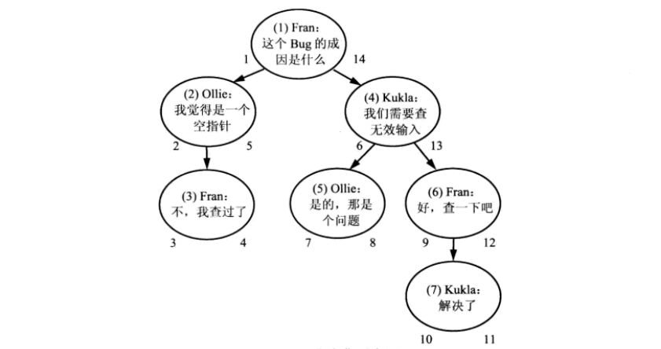
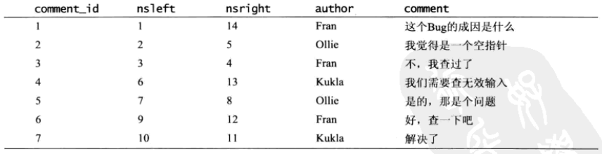
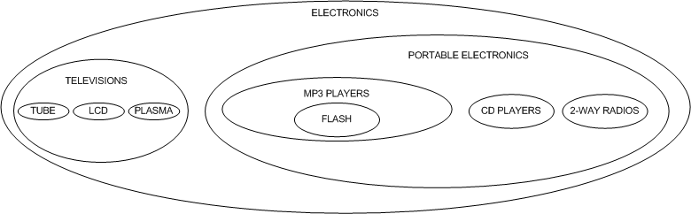

# mysql当中树类型结构表的设计

mysql树类型的表的设计, 通常有以下四种:

- Adjacency List(邻接表): 每一条记录保存其 `parent_id`.
- Path Enumerations(路径枚举): 每一条记录保存整个tree path经过的node枚举.
- Nested Sets(嵌套集, 实质为双向链表): 每一条记录保存left和right节点.
- Closure Table(闭包表): 维护一个表, 所有的tree path作为记录进行保存.

**操作代价对比:**

| Design | Tables | Query Child | Query Tree | Insert | Delete | Ref |
| ------ | ------ | ----------- | ---------- | ------ | ------ | --- |
| Adjacency List | 1 | Easy | Hard | Easy | Easy | Yes |
| Path Enumerations | 1 | Easy | Easy | Easy | Easy | No |
| Nested Sets | 1 | Hard | Easy | Hard | Hard | No |
| Closure Table | 2 | Easy | Easy | Easy | Easy | Yes |


## Adjacency List(邻接表)

表结构设计:

```
{
    id: int(10) unsigned primary key,
    parentid: int(10) unsigned,
    ...
}
```

特点: 

- 查询一个节点的直接后代和直接前代.
- 增加叶子节点
- 修改节点的位置简单


不足:

- 查询整棵树非常复杂
- 删除中间节点非常复杂


## Path Enumerations (路径枚举)

路径枚举是一个由连续的直接层级关系组成的完整路径.

表结构设计
```
{
    id: int(10) unsigned primary key,
    path: varchar(256),    // 路径, 保存的是祖先节点的信息(当然也可以包含自己)
    ...
}
```

特点:

- 查询方便
- 增加/删除叶子节点简单
- 修改节点方便


不足:

- 数据库不能确保路径的格式总是正确或者路径中的节点确实存在
- 树的深度有限制, 因而不能够支持树结构的无限扩展


## Nested Sets (嵌套集)

嵌套集解决方案是存储子孙节点的相关信息, 而不是节点的直接祖先. 使用两个数字来编码每个节点,
从而表示这一信息, 可以将这两个数字成为left和right.

表结构设计:
```
{
    id: int(10) unsigned primary key,
    left: int,
    right: int,
    ...
}
```

每个节点通过如下方式确定left和right的值: left的数值小于该节点所有后代的id, 同时right
的值大于该节点所有后代的id.

确定这三个值(left, id, right)的简单方法是对树进行一次深度优先遍历, 再逐层深入的过程中
依次分配left的值, 并在返回时依次递增地分配right的值.

一旦为每个节点分配了这些数值, 就可以使用它们来找到给定节点的祖先节点和后代.

计算案例如下:






例如: 获取id为4的所有后代

```sql
SELECT t2.*
FROM t as t1 JOIN t as t2 ON t2.left BETWEEN t1.left AND t1.right
WHERE t1.id = 4;
```

例如: 获取id为6的所有祖先

```sql
SELECT t2.*
FROM t as t1 JOIN t as t2 ON t1.left BETWEEN t2.left AND t2.right
WHERE t1.id = 6;
```

特点:

- 删除非叶子节点时, 它的后代会自动代替被删除的节点,成为其直接祖先节点的直接后代.


缺点:

- 获取一个节点的直接祖先或者直接后代, 在嵌套集的设计中会变得比较复杂. 

```
在嵌套集中, 如果需要查询一个节点的直接祖先, 思路: 给定节点node的直接祖先是这个节点的一个
祖先, 且这两个节点之间不应该有任何其他节点, 因此,可以使用递归的外联结来查询一个节点x, 它
既是node的祖先, 也同时是另外一个y节点的后代, 随后让y=x并继续查找, 直到查询返回空, 即不
存在这样的节点, 此时y便是c的直接祖先节点.
```


具体案例:

嵌套集中, 使用新的视角看待树状结构. **不是使用节点或行, 而是使用嵌套容器**, 结构如下图
所示:




- 数据结构: category

```sql
CREATE TABLE category (
    id INT AUTO_INCREMENT PRIMARY KEY,
    name VARCHAR(20),
    left INT,
    right INT
);

#插入元素
INSERT INTO category VALUES(1,'ELECTRONICS',1,20),(2,'TELEVISIONS',2,9),
(3,'TUBE',3,4), (4,'LCD',5,6),(5,'PLASMA',7,8),(6,'PORTABLE ELECTRONICS',10,19),
(7,'MP3 PLAYERS',11,14), (8,'FLASH',12,13),(9,'CD PLAYERS',15,16),
(10,'2 WAY RADIOS',17,18);
```

```
+----+----------------------+------+-------+
| id | name                 | left | right |
+----+----------------------+------+-------+
| 1  | ELECTRONICS          |   1  |  20   |
| 2  | TELEVISIONS          |   2  |   9   |
| 3  | TUBE                 |   3  |   4   |
| 4  | LCD                  |   5  |   6   |
| 5  | PLASMA               |   7  |   8   |
| 6  | PORTABLE ELECTRONICS |  10  |  19   |
| 7  | MP3 PLAYERS          |  11  |  14   |
| 8  | FLASH                |  12  |  13   |
| 9  | CD PLAYERS           |  15  |  16   |
| 10 | 2 WAY RADIOS         |  17  |  18   |
+----+----------------------+------+-------+
```

下面是插入数据进行编号图:


这种设计可以使用树状结构展示:


说明: 构建这种树需要从左向右, 每次一层的向下遍历其子节点, 对于叶子节点则指定其右值并移动到
其右边的兄弟节点. 这种算法: **深度优先遍历**

- 遍历树

基于这样一个前提遍历整个树: 一个节点的左值总数处于父节点的左值和右值之间:

```sql
SELECT node.name
FROM category AS node, category AS parent
WHERE node.left BETWEEN parent.left AND parent.right AND parent.name='ELECTRONICS'
ORDER BY node.left;
```

- 找出所有的叶子节点

叶子节点的左值和右值永远是连续的．

```sql
SELECT name 
FROM category
WHERE right=left+1;
```

- 查询单一路径

```sql
SELECT parent.name
FROM category AS node, category AS parent
WHERE node.left BETWEEN parent.left AND parent.right AND node.name='FLASH'
ORDER BY parent.left;
```

- 获取节点深度

```sql
SELECT node.name, (COUNT(parent.name)-1) AS depth
FROM category AS node, category AS parent
WHERE node.left BETWEEN parent.left AND parent.right
GROUP BY node.name
ORDER BY node.left;
```

使用depth结合CONCAT以及REPEAT函数来在前面添加空格:

```sql
SELECT CONCAT(REPEAT(' ', COUNT(parent.name)-1), node.name) AS name
FROM category AS node, category AS parent
WHERE node.left BETWEEN parent.left AND parent.right
GROUP BY node.name
ORDER BY node.left;
```

- 子树的深度

```sql
SELECT node.name (COUNT(parent.name) - (sub_tree.depth+1)) AS depth
FROM category AS node, 
     category AS parent, 
     category AS sub_parent,
     (
        SELECT node.name, (COUNT(parent.name)-1) AS depth
        FROM category AS node, category AS parent
        WHERE node.left BETWEEN parent.left AND parent.right AND node.name='PORTABLE ELECTRONICS'
        GROUP BY node.name
        ORDER BY node.left
     ) AS sub_tree
WHERE node.left BETWEEN parent.left AND parent.right AND 
      node.left BETWEEN sub_parent.left AND sub_parent.right AND 
      sub_parent.name = sub_tree.name
GROUP BY node.name
ORDER BY node.left;
```