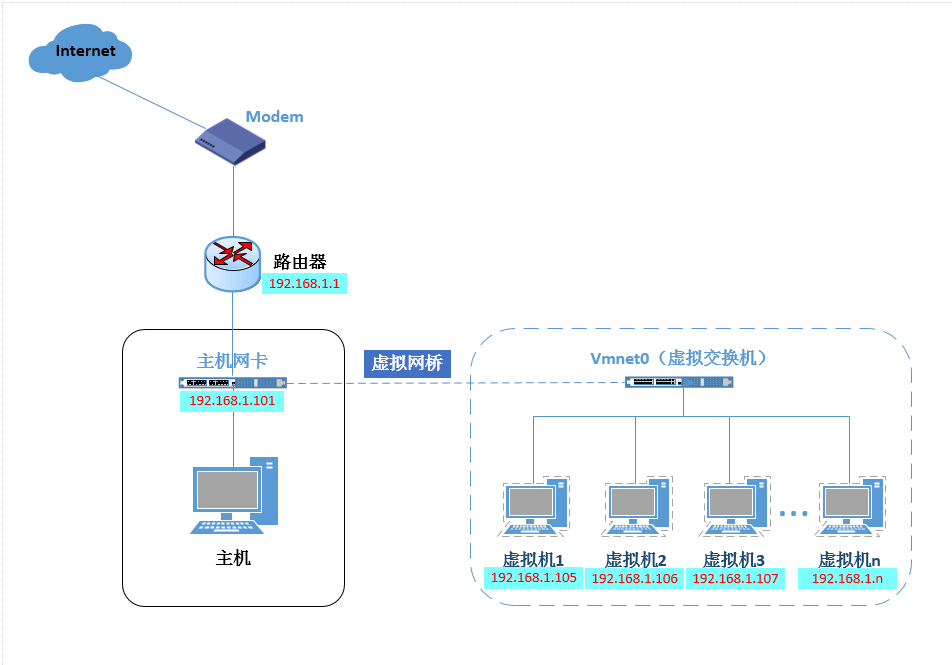

# Vmware, VirtualBox 虚拟机的网络连接模式

Vmware 和 VirtualBox 是都是虚拟软件, 可以虚拟出一个独立的操作系统. 它们的网络连接模式主要有以下几种:

- Bridged (桥接模式)

- NAT (网络地址转换模式)

- Host-Only (仅主机模式)


## Bridge (桥接模式)

桥接模式, 就是将主机网卡与虚拟机虚拟网卡利用虚拟网桥进行通信. 在桥接模式作用下, 类似于把 `物理主机` 虚拟为一个交
换机, 所有桥接设置的虚拟机连接到这个交换机的一个接口上, 物理主机同样插在这个交换机当中, 所以所有桥接下的网卡与网卡
都是交换模式的, 相互可以访问而不干扰. 

在桥接模式下, 虚拟机ip地址需要与主机在同一个网段, 如果需要联网, 则网关与DNS需要与主机网卡一致.




1.桥接模式是通过虚拟网桥将 **主机上的网卡** 与 **虚拟交换机Vmnet0** 连接在一起, 虚拟机上的虚拟网卡(虚拟机当中
的eth0, eth1等)都将连接到虚拟交换机 `Vmnet0` 上, 所以桥接模式的虚拟机ip必须与主机ip在同一个网段且子网掩码, 网
关与DNS也要与主机网卡保持一致.

> 在Vmware当中虚拟交换机是Vmnet0,实质上就是主机网卡. 在VirtualBox当中虚拟主机就是主机的网卡.

2.虚拟网桥会转发**主机网卡接收到的广播和组播信息**, 以及**目标为虚拟交换机网段的单播**. 所以, 与虚拟交换机连接的
虚拟机的网卡(eth0,eth1等)接收到了路由器发出的DHCP信息及路由更新.


## NAT (地址转换配置)

NAT 模式借助 **虚拟NAT设备** 和 **虚拟DHCP服务器**, 使得虚拟机可以联网.


1.在连接Vmnet8虚拟交换机时, 虚拟机会虚拟NAT设备 及 DHCP服务器连接到 `VMent8` 虚拟交换机上, 同时也会将主机上的虚拟网
卡 `WMware Network Adapter Vmnet8` 连接到 `Vmnet8` 虚拟交换机上. 虚拟网卡 `WMware Network Adapter Vmnet8` 
只是作为主机与虚拟机通信的接口, 虚拟机并不是依靠虚拟网卡 `WMware Network Adapter Vmnet8` 来联网的.

2.在NAT模式中, 主机网卡直接与虚拟NAT设备相连, 然后虚拟NAT设备与虚拟DHCP服务器一起连接到虚拟交换机 `VMnet8` 上. 这样
就实现了虚拟机联网. `WMware Network Adapter Vmnet8` 主要是为了实现主机与虚拟机之间的通信.


## Host-Only (仅主机模式)

Host-Only模式其实就是NAT模式去除了虚拟NAT设备, 然后使用 `VMware Network Adapter Vmnet1` 虚拟网卡连接 `Vmnet1`
虚拟交换机来与虚拟机通信的, Host-Only模式将虚拟机与外网隔开, 使得虚拟机成为一个独立的系统, 只与主机相互通信.


1.Host-Only模式通过主机的虚拟网卡 `VMware Network Adapter Vmnet1` 来连接虚拟交换机 `VMnet1`, 从而达到与虚拟机
通信的目的. 如果想要在Host-Only模式下联网, 可以将能联网的主机网卡共享给 `VMware Network Adapter Vmnet1`, 这样就实
现虚拟机联网.


## VirtualBox 下三种模式的配置

- Bridge (桥接模式)

- NAT (网络地址转换模式)

根据最新版本6.08版本的VirtualBox的操作

1. 添加NAT Network

`工具` -> `全局设定` -> `网络`, 添加一个网络

2. 设置虚拟机的网卡

到 `设置` -> `网络` 当中, 连接方式选择 `NAT网络`, 界面名称选择上一步添加的NAT Network

3. 配置虚拟机的网卡

下面是以Ubuntu为例.

网卡配置,设置静态ip(非必须), 配置文件 /etc/network/interface

```
auto eth0               # 添加网卡
iface eth0 inet static  # 选择静态IP分配方式
address 10.0.2.4        # 指定需要的IP
gateway 10.0.2.1        # 默认网关
netmask 255.255.255.0   # 掩码 
```

DNS配置(非必须), /etc/resolve.conf

```
nameserver 192.168.0.1
```

- Host-Only (仅主机模式)

1. 创建 Host-Only Network

在 `管理` -> `主机网络管理器` 当中, 添加一个仅主机网络.

2. 设置虚拟机的网卡

到 `设置` -> `网络` 当中, 连接方式选择 `仅主机(Host-Only)网络`, 界面名称选择上一步添加的Host-Only Network.
