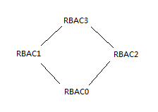
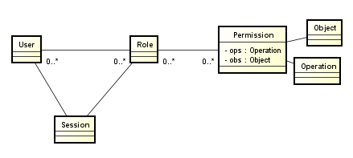
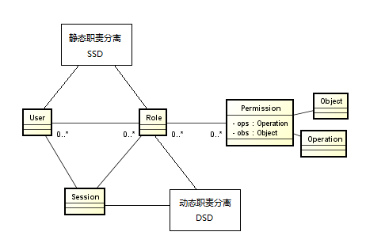
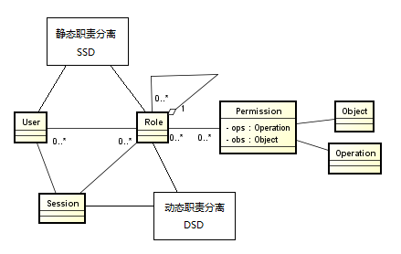

# RBAC (Role-Based Access Control)基于角色的访问控制

## 概述 

RBAC认为权限的过程可以抽象概括为: 判断 【Who是否可以对What进行How的访问操作(Operator)】 这个逻辑表达式
的值是否为True的求解过程. 即将权限问题转换为Who, What, How的问题. Who, What, How构成了访问权限三元组.


RBAC支持公认的安全原则: 最小特权原则, 责任分离原则和数据抽象原则.

- 最小特权原则的实现, 是因为在RBAC模型中可以通过限制分配给角色权限的多少和大小来实现, 分配给与某用户对应的角色
的权限只要不超过该用户完成其任务的需要就可以了.

- 责任分离原则的实现,是因为在RBAC模型中可以通过在完成敏感任务过程中分配两个责任上互相约束的两个角色来实现, 例如
在清查账目时, 只需要设置财务管理员和会计两个角色参加就可以了.

- 数据抽象是借助于抽象许可权这样的概念实现的, 如在账目管理活动中, 可以使用信用, 借方等抽象许可权, 而不是使用操作
系统提供的读, 写, 执行等具体的许可权. 但是RBAC并不强迫实现这些原则, 安全管理员可以允许配置RBAC模型使它不支持这
些原则. 因此, RBAC支持数据抽象的程度与RBAC模型的实现细节有关.


## RBAC96模型家族

RBAC96是一个模型族, 其中包括RBAC0~RBAC3四个概念性模型.

1.基本模型RBAC0定义了完全支持RBAC概念的任何系统的最低需求.

2.RBAC1和RBAC2两者都包含RBAC0，但各自都增加了独立的特点，它们被称为高级模型.

```
RBAC1中增加了角色分级的概念, 一个角色可以从另一个角色继承许可权.

RBAC2中增加了一些限制, 强调在RBAC的不同组件中在配置方面的一些限制.
```

3.RBAC3称为统一模型,它包含了RBAC1和RBAC2, 利用传递性, 也把RBAC0包括在内. 这些模型构成了RBAC96模型族.





## RBAC0 模型

RBAC0的模型包含用户(U), 角色(R) 和 许可权(P)等3类实体集合.

RBAC0是RBAC的核心, 主要有4部分组成:

```
1. 用户(User)
2. 角色(Role)
3. 许可(Permission)
4. 会话(Session)
```

**表关系图**




**实体关系图**


RBAC0定义了能构成一个RBAC控制系统的最小的元素集合.

在RBAC之中, 包含用户user(USER), 角色role(ROLE), 目标object(OBJECT), 操作operation(OPERATION), 
许可权permission(PERMISSION)五个基本数据元素, 此模型指明用户, 角色, 访问权限和会话之间的关系.

规则:

```
1.每个角色至少具备一个权限, 每个用户至少扮演一个角色; 

2.可以对两个完全不同的角色分配完全相同的访问权限; 

3.会话由用户控制,一个用户可以创建会话并激活多个用户角色, 从而获取相应的访问权限, 用户可以在会话中更改激活角色,
并且用户可以主动结束一个会话.
```

用户和角色是多对多的关系,表示一个用户在不同的场景下可以拥有不同的角色.

角色和许可(权限)是对对多的关系, 表示角色可以拥有多个权限.


## RBAC1 模型

RBAC1, 基于RBAC0模型, 引入角色间的继承关系, 即角色上有了上下级的区别, 角色间的继承关系可分为一般继承关系
和受限继承关系. 一般继承关系仅要求角色继承关系是一个绝对偏序关系, 允许角色间的多继承, 而受限继承关系则进一步
要求角色继承关系是一个树结构, 实现角色间的单继承.

这种模型合适于角色之间的层次明确,包含明确.


**表关系图**


## RBAC2 模型

RBAC2, 基于RBAC0模型的基础上, 进行了角色的访问控制.

RBAC2模型中添加了责任分离关系. RBAC2的约束规定了权限被赋予角色时, 或角色被赋予用户时, 以及当用户在某一时刻激活
一个角色时所应遵循的强制性规则. 责任分离包括 `静态责任分离` 和 `动态责任分离`. `约束` 与 `用户-角色-权限` 关
系一起决定了RBAC2模型中用户的访问许可, 此约束有多种.

- 互斥角色: 同一用户只能分配到一组互斥角色集合中至多一个角色, 支持责任分离的原则. 互斥角色是指各自权限互相制约的两
个角色. 对于这类角色一个用户在某一次活动中只能被分配其中的一个角色, 不能同时获得两个角色的使用权. 常举的例子: 在审
计活动中, 一个角色不能同时被指派给会计角色和审计员角色.

- 基数约束: 一个角色被分配的用户数量受限; 一个用户可拥有的角色数目受限; 同样一个角色对应的访问权限数目也应受限, 以
控制高级权限在系统中的分配, 例如公司的领导人有限的;

- 先决条件角色: 可以分配角色给用户仅当该用户已经是另一角色的成员; 对应的可以分配访问权限给角色. 仅当该角色已经拥有
另一种访问权限. 即要想获得较高的权限, 要首先拥有低一级的权限. 就像我们生活中, 国家主席是从副主席中选举的一样.

- 运行时互斥: 例如,允许一个用户具有两个角色的成员资格,但在运行中不可同时激活这两个角色.

**表关系图**




## RBAC3 模型

RBAC3, 也就是最全面的权限管理, 它是基于RBAC0的基础上, 将RBAC1和RBAC2进行整合, 同时也最复杂的权限控制.

**表关系图**

