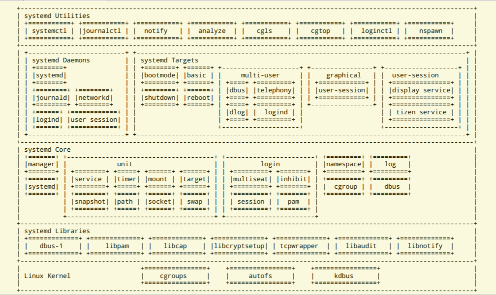

# systemd

## systemd相关概念

> systemd 到底是什么?

systemd 是 Linux 操作系统的系统和服务管理器. 在启动时作为PID的第一个进程运行时, 它充当启动系统并维护 `用户空间`
服务的初始化系统. 启动单独的实例, 以供登录用户启动其服务. systemd 通常不由用户直接调用, 而是作为 `/sbin/init`
符号链接安装并在早期引导期间启动.

systemd启动后, 首先会去三个目录下找相应的配置文件, 按照优先级从高到底为 `/etc/systemd`, `/usr/lib/systemd`
和 `/lib/systemd`, 优先级高的配置文件会覆盖优先级低的配置文件. 

### unit 的概念

systemd 的配置文件, 也叫作 unit 文件. 关于 unit 主要有以下几种:

- service: 代表一个后台进程, 比如 mysqld. 这是最常用的一类.

- socket: 此类 unit 封装系统和互联网中的一个 socket. 当下, systemd 支持 `流式`, `数据报` 和 `连续包` 的
  AF_INET, AF_INET6, AF_UNIX socket. 也支持传统的 FIFOs 传输模式. 每一个 socket unit 都有一个相应的服务unit. 
  相应的服务在第一个"连接"进入套接字时就会启动. (例如, nscd.socket 在有新的连接后便启动 nscd.service.)

- device: 此 unit 封装一个存在于 Linux 设备树中的设备. 每一个使用udev规则标记的设备都将会在是systemd中作为一个
  设备 unit 出现. udev 的属性设置可以作为配置设备 unit 依赖关系的配置源. 

- mount: 此类 unit 封装文件系统结构层次中的一个挂载点. systemd将对这个挂载点进行监控和管理. 比如可以在启动时自动
  将其挂载; 可以在某些条件下自动卸载. systemd会将/etc/fstab中的条目都转换为挂载点, 并在开机时处理.

- automount: 此类 unit 封装系统结构层次中的一个自挂载点. 每一个自挂载 unit 对应一个 `已挂载的` 挂载 unit, 当该
  自动挂载点被访问时, systemd 执行挂载点中定义的挂载行为.

- swap: 和挂载配置单元类似, 交换配置单元用来管理交换分区. 用户可以用交换配置单元来定义系统中的交换分区, 可以让这些交
  换分区在启动时被激活.

- target: 此类 unit 为其他配置单元进行逻辑分组. 它们本身实际上并不做什么, 只是引用其他 unit 而已. 这样便可以对
  unit 做一个统一的控制. (例如: multi-user.target 相当于在传统使用 `SysV` 的系统中的运行级别 5; bluetooth.target
  只有在蓝牙适配器可用的情况下才调用与蓝牙相关的服务, 如 bluetooth 守护进程, obex 守护进程等)

- timer: 定时器 unit 用来定时触发用户定义的操作. 这类 unit 取代了atd, crond等传统的定时服务.

- snapshot: 与target unit 类似, 快照的一组配置单元. 它保存了系统当前的运行状态.


## service unit 配置

一般情况下, 最常用的是 service. 关于 service, 配置参数, 一般最常用的参数有 `Type`, `ExecStarPre`, `ExecStart`
`ExecStartPost`, `ExexStop`, `ExecStopPost`, `ExecReload`, `ExecCondition`, `Restart`, `OOMPolicy`. 

一个 Service unit 配置文件的格式:

```
[Unit]
    ...

[Install]
    ...
    
[Service]
    ...
```

service 包含 `[Unit]`, `[Install]`, `[Service]` 三个 Section.

- `[Unit]` Section 参数:

> **Requires**: 当前 unit 依赖其他 unit, 强依赖
>
> **Wants**: 弱依赖
>
> 
> **Before**: 如果该字段指定的unit也要启动, 那么必须在当前unit之后启动
> 
> **After**: 如果该字段指定的unit也要启动, 那么必须在当前unit之前启动
> 
> **Condition**: 当前unit运行满足的条件


- `[Install]` Section 参数:

>
> **WantedBy**: 一个或多个 target, 当前 unit 激活时符号链接会放入 /etc/systemd/system 目录下以 target名+.wants
> 后缀构成的子目录
>
> **RequiredBy**: 强依赖

- `[Service]` Section 参数: 

> **Type**: 启动时进程的行为. 值是 simple, exec, forking, oneshot, dbus, notify 或 idle 之一.
>
> - simple(当设置了 ExecStart, 但是没有设置 Type 和 BusName 时, 此时是默认值), 那么  ExecStart 进程就是该服务
>   的主进程, 并且 systemd 会认为创建了该服务的主服务进程后, 该服务就已经启动完成. 在这种模式下, 如果该进程需要为系统
>   中的其他进程提供服务时, 那么必须在启动之前先建立好通信通道(例如,套接字), 这样, 在创建主服务进程后, 执行主服务进程之
>   前, 即可启动后继单元.
>
> - exec 和 simple 类似, 不同之处在于, 只要该服务的主服务进程执行完成后, systemd 才会认为该服务启动完成. 其他后继
>   单元必须一直阻塞到这个时间点之后才能继续启动. 即 simple 表示当 fork() 函数返回时, 即算启动完成, 而 exec 则表示
>   仅在 fork()与 execve() 函数都执行成功时, 才算启动完成.
>
> - oneshot 与 simple 类似, 不同的是, 只有在该服务的主服务进程退出后, systemd 才会认为该服务启动完成, 才会开启后继
>   单元. 通常需要设置 RemainAfterExit 选项. 当 Type 和 ExecStart 都没有设置时, 是默认值.
>
> - dbus 与 simple 类似, 不同之处在于, 该服务只有获得了 BusName 指定的 D-Bus 名称之后, systemd 才会认为该服务启
>   动完成. 才会开始启动后继单元. 当设置了 BusName 时, 此类型是默认值.
>
> - notify 与 exec 类似, 不同之处在于, 该服务将会在启动完成后通过 notify 之类的接口发送一个通知消息. systemd 将会
>   在启动后继单元之前, 首先确保该进程已经成功的发送了这个消息. 必须设置 NotifyAccess 值
>
> - idle 与 simple 类似. 不同之处在于, 服务进程将会被延迟到所有活动任务都完成之后再执行. 这样可以避免控制台上的状态信
>   息与 shell 脚本输出混杂在一起. 
>
> - forking, 表示 ExecStrt 进程将会在启动过程中使用 fork() 系统调用. 也就是当所有通信渠道都已建好, 启动亦已成功之后,
>   父进程将会退出, 而子进程将作为主服务进程继续运行. 这是传统 UNIX 守护进程的经典做法. 这种状况下, systemd 会认为在
>   父进程退出之后, 该服务就已经完成启动. 建议同时设置 PIDFile 参数
>
> 建议对长时间持续运行服务尽可能使用 Type=simple(简单快速). 当客户端要通过仅有服务本身创建的 IPC 通道(而非由 systemd
> 创建的socket 或 D-bus 之类) 连接到该服务时, 建议选择 notify 或 dbus (该服务必须提供 D-Bus 接口). 如果能够保证服
> 务进程调用成, 服务进程自身不做或只做很少的初始化工作(且不大可能初始化失败), 建议选择 exec.
>
> <hr>
>
> **RemainAfterEit**: 当服务的所有进程全部退出之后, 是否依然将此服务视为活动(active) 状态. 默认值是 no
>
> **PIDFile**: 该服务 PID 文件路径(一般位于 /run 目录下). 建议 Type=forking 的状况下设置此选项. 如果设为相对路径, 
> 表示相对于 /run/ 目录.
>
> **BusName**: 设置与此服务通信所使用的 D-Bus 名称. 在 Type=dbus 下必须明确设置此选项.
>
> <hr>
>
> *可执行文件前的特殊前缀*:
>
> "@", 在绝对路径前加上可选的 "@" 前缀, 那么气候的那些参数将依次作为 "argv[0], argv[1] ..." 传递给被执行的进程.(
> argv[0] 是可执行文件本身)
>
> "-", 在绝对路径前加上可选的 "-" 前缀, 那么即使该进程以失败状态(例如非零返回值)退出,也会被视为成功退出, 但是同时会留
> 下错误日志.
>
> "+", 在绝对路径前加上可选的 "+" 前缀, 那么进程将拥有完全的权限(超级用户的特权), 并且 User, Group, CapablityBoundSet
> 所设置的权限限制等将被该命令行启动的进程忽略.(但是对其他 ExecStart, ExecStop 有效)
>
>
> **ExecStartPre**: 
>
> **ExecStartPost**: 在执行 ExecStart 之前/后执行的命令行. (如果某个无 "-" 前缀的命令执行失败, 那么剩下的命令行
> 不会被继续执行, 同时该 unit 变为失败 (failed) 状态)
>
>> 注意: 不可将 ExecStartPre 用于需要长时间执行的进程. 因为所有有 ExecStarrPre 派生的子进程都会在启动 ExecStart 
>> 服务进程之前被杀死.
>
>> 注意: 如果在服务启动完成之前, 任意一个 ExecStartPre, ExecStart, ExecStartPost 中无 "-" 前缀的命令执行失败
>> 或超时, 那么 ExecStopPost 将会被继续执行. 而 ExecStop 则会被跳过.
>
> **ExecStart**: 启动当前服务的命令
>
> **ExecStop**: 停止当前服务时执行的命令.
> **ExecStopPost**: 停止当前服务后执行的命令. 建议使用此设置进行清理操作, 即使系统无法正常启动, 清理操作也应该执行.
>
> **ExecReload**: 用于设置当该服务被要求重新载入配置时所执行的命令行.
>
> <hr>
>
> **RestartSec**: 设置在重启服务(ReStart)前暂停多长时间. 默认值是 100ms. 
>
> **TimeoutStartSec**: 设置该服务允许的最大启动时长. 如果守护进程未能在限定的时长内发出 "启动完毕" 信号, 那么该服务
> 将被视为启动失败, 并会被关闭. 
>
> **TimeoutStopSec**: 设置每个 ExecStop 的超时时长. 如果其中之一超时, 那么所有后继的 ExecStop 就会被取消, 并且
> 在该服务也会被SIGTERM信号强制关闭. 如果该服务没有设置 ExecStop, 那么该服务将会立即被 SIGTERM 信号强制关闭. 设置
> 该服务自身停止的超时时长. 如果超时, 那么该服务将会立即被 SIGTERM 信息强制关闭
>
> **TimeoutSec**: 同时设置 TimeoutStartSec 和 TimeoutStopSec
>
> **RuntimeMaxSec**: 允许服务持续允许的最大时长. 超出限制时长, 服务会被强制终止. 默认值为 "infinity" (不限时长)
>
> <hr>
>
> **SuccessExitStatus**: 额外定义其他的进程"正常退出"状态. 
>
> **Environment**: 指定环境变量
>
> **Restart**: 当服务进程 正常退出, 异常退出, 被杀死, 超时的时候, 是否重新启动该服务. "服务进程" 是指 ExeStartPre, 
> ExecStartPost, ExecStop, ExecStopPost, ExecReload 中设置的进程. 当进程是由于 systemd 的正常操作 (例如,
> systemd stop|restart) 而停止操作时, 该服务不会被重新启动. 取值可以是 no, always, on-success, on-failure, 
> on-abnormal,on-abort, on-watchdog 之一. no是默认值, 表示不会被重启. always表示会无条件的重启.
>
> **RestartPreventExitStatus**: 设置一系列以空白分隔的数字退出码或信号名称, 当进程的退出码或收到的信号与此处的设置
> 匹配时, 无论 Restart 是如何设置的, 该服务都将无条件的 *禁止重新启动*. 例如 `RestartPreventExitStatus=1 6 SIGABRT`
> 
> **RestartForceExitStatus**: 设置一系列以空白分隔的数字退出码或信号名称, 当进程的退出码或收到的信号与此处的设置匹配
> 时, 无论 Restart 是如何设置的, 该服务都将无条件的 *被自动重新启动*. 默认值是空, 表示完全遵循 Restart 的设置
> 
> <hr>
> 
> *路径*:
>
> **WorkingDirectory**: 设置进程的工作目录. 既可以设置特殊值 "~", 表示 User 用户的家目录, 也可以设一个以 RootDirectory
> 为基准的绝对路径. 例如, 当 RootDirectory=/sysroot, 并且 WorkingDirectory=/work/dir 时, 实际的工作目录将是
> `/sysroot/work/dir`. 当 systemd 作为系统实例运行时, 此选项的默认值是 /, 当 systemd 作为用户实例运行时, 此选项
> 的默认值是对应用户的家目录.
>
> **RootDirectory**: 此选项仅可用于系统单元(不适用于用户单元). 设置以 chroot 方式执行进程的根目录. 必须设为一个主机
> (或容器)的根目录(即运行systemd的系统根目录)为基准的绝对路径. 如果设置此选项, 必须确保进程及其辅助文件在 chroot 中
> 确实可用.
>
> <hr>
>
> *凭证*:
> 
> **User=, Group=**: 设置进程在执行时使用的用户与组.既可以设为一个数字形式的 UID/GID 也可以设为一个字符串形式的名称.
> 对于系统服务(由PID=1 的 systemd 系统实例管理) 以及由 root 运行的用户服务(由 root 用户启动的用户实例管理), User 
> 的默认值是 "root", 同时亦可明确将 User 设为其他用户. 对于普通用户运行的用户服务, User 的默认值是该用户自身, 并且
> 禁止将 User 切换为其他用户.
>
> <hr>
>
> *进程属性*:
>
> **LimitCPU=, LimitFSIZE=, LimitDATA=, LimitSTACK=, LimitRSS=, LimitNOFILE=, LimitAS=, LimitNPROC=,
> LimitMEMLOCK=, LimitLocks=, LimitSIGPENDING=, LimitMSGQUEUE=, LimitNICE=, LimitRTPRIO=, LimitRTTIME=**
> 设置进程的各种软/硬资源限制. 这些指令的值有两种表示法, 一个单独的 vlaue 值表示将软硬两种限制设为同一值. 而以冒号分割
> 的 soft:hard 值表示分别设置软限制与硬限制(例如, LimitAS=4G:16G). 特殊值 `infinity` 表示没有限制. 对于以字节为
> 单位的选项, 可以使用以 1024 为基数的 K, M, G, T, P, E 后缀. 对于时间限制, 可以加上 "ms", "s", "min", "h", "d"
> "w" 等明确的时间单位后缀.  如果仅设置一个整数而没有单位, 对于 LimitCPU= 默认单位是秒, 对于 LimitRTTIME= 默认单位
> 是微秒. LimitNICE= 的值有两种表示法, 可以设为带 "+" 或 "-" 前缀的谦让值 (-20 到 19 之间); 也可以设置为无前缀的
> 原始资源限制参数 (1 到 40 之间)
>

[执行环境配置](http://www.jinbuguo.com/systemd/systemd.exec.html)

[服务单元配置](http://www.jinbuguo.com/systemd/systemd.service.html)


## systemd架构



> systemctl是systemd的主命令, 用于管理系统.

```
sudo systemctl reboot
sudo systemctl poweroff 关闭系统
sudo systemctl halt    cpu停止工作
sudo systemctl suspend  暂停系统
sudo systemctl hybrid-sleep 交互式休眠
```

> systemd-analyze 查看启动耗时
```
systemd-analyze blame 查看每个服务的启动耗时
systemd-analyze critical-chain 查看启动过程流
```

> hostnamectl 查看当前主机的信息
```
hostnamectl set-hostname xx 设置主机名称
```

> localectl 查看本地化设置


> timedatectl 查看当前时区设置

> loginctl 查看当前登录的用户
```
loginctl list-seeions 列出当前的Session
loginctl list-users 列出当前登录的用户
```

## unit 控制命令

systemctl list-units [OPTIONS] 查询系统的unit

unit状态:

```
systemctl status [NAME] // NAME可以是具体的资源, 比如 user.slice
systemctl is-active NAME // 某个unit是否正在运行
systemctl is-failed NAME // 某个unit是否处于启动失败状态
systemctl is-enabled NAME // 某个unit是否建立了启动链接
```


管理unit:

```
sudo systemctl start|stop|kill|reload unit
sudo systemctl daemon-reload 重新加载所有修改过的配置文件

sudo systemctl show unit  显示unit所有底层参数
sudo systemctl show -p PARAM unit 显示unit的具体参数
sudo systemctl set-property unit PARAM=VALUE 设置属性
```

依赖关系:

```
systemctl list-dependcies [unit]
```

### unit的配置文件

systemd 默认从目录/etc/systemd/system/读取配置文件. 但是里面大部分文件都是符号链接, 指向目录/usr/lib/systemd/system/

```
systemctl enable unit 用于在上面的两个目录之间,建立符号链接关系
```

配置文件状态:

```
systemctl list-unit-files [--type=TYPE]
   enabled: 已经建立启动链接
   disabled: 没有建立启动链接
   static: 该配置文件没有[Install]部分(无法执行), 只能作为其他配置文件的依赖
   masked: 该配置文件被禁止建立启动链接
```

获取 unit 配置文件内容:

```
systemctl cat unit  查看unit配置文件的内容
```


### 日志管理

journalctl 查看所有的日志(内核日志和应用日志)

```
sudo journalctl -k 查看内核日子
sudo journalctl -b 查看系统本次启动的日志

sudo journalctl _PID=PID 查看指定进程的日志
sudo journalctl SCRIPT 查看指定脚本的日志
sudo journalctl -u unit 查看unit的日志

sudo journalctl -n NUM  尾部最新NUM行日志

sudo journalctl -f  实时显示最新日志
```