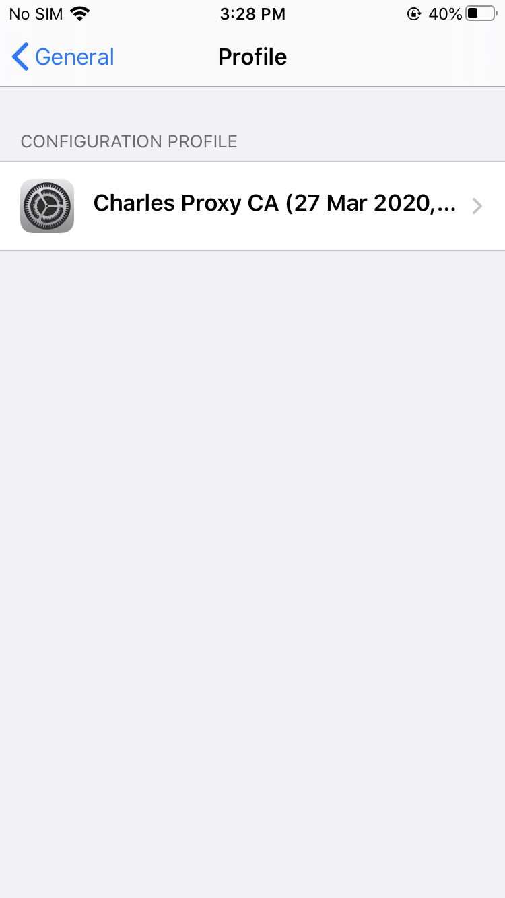
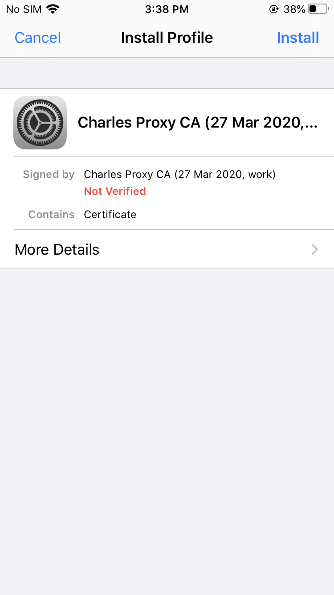
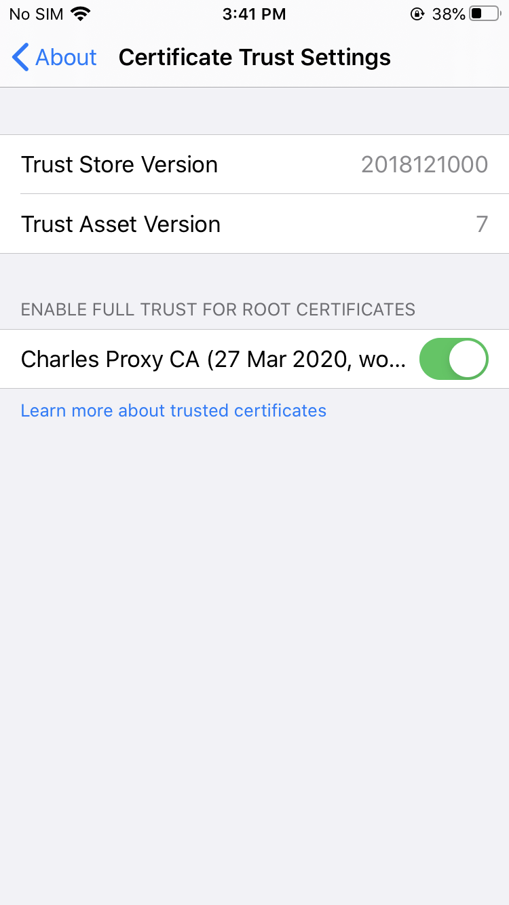

# Charles 在 iPhone iso 13 版本上安装证书方法

- Charles 当中点击 `Help > SSL Proxying > Install Charles Root Certificate on a Mobile Device or Remote Browser`

- 点击 `iPhone` 手机的 `Safari`, 输入 `chls.pro/ssl`, 下载证书

- 进入 `iPhone` 手机的 `Settings > General > Profile(s)`:

- 点击 `Install`, 安装 `chls` 证书.

- 进入 `iPhone` 手机的 `Settings > General > About > Certificate Trust Settings`, 启用 `Charles Proxy CA` 证书.

