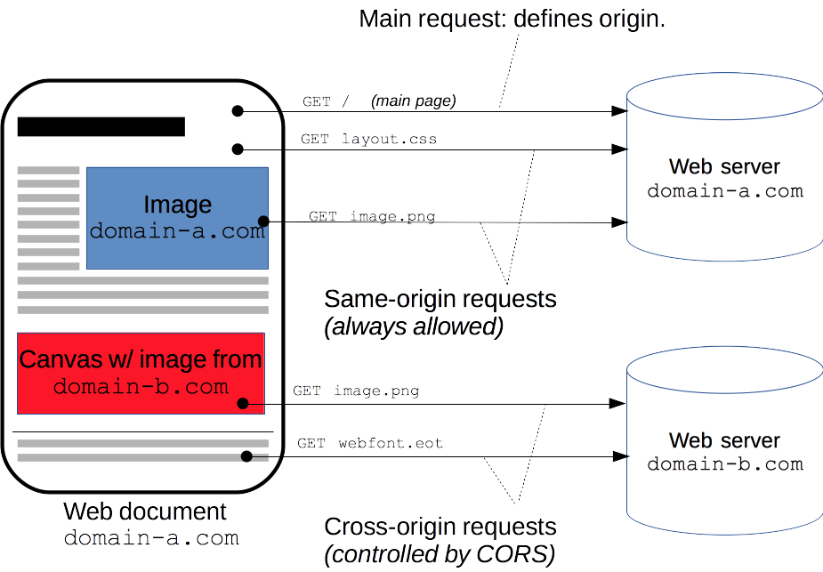

# 跨域资源共享

## 跨域资源共享(CORS)

跨域资源共享(CORS)是一种机制, 它使用额外的 **HTTP头** 来告诉浏览器让运行在一个origin(domain)上的Web应用
被准许访问来自不同源服务器上的指定的资源. 当一个资源从 **与该资源本身所在的服务器不同的域,协议或端口** 请求另
外一个资源时, 该资源会发起一个跨域 HTTP 请求.

例如: 前端主机: www.fontend.com, 后端主机: www.backend.com. 当 `前端` 向 `后端` 发送API请求的时候, 由
于域名不同, 导致该请求是一个跨域请求.

处于安全考虑, 浏览器限制从脚本内发起的跨域HTTP请求. 例如,XMLHttpRequest和Fetch API遵循同源策略. 这意味着
使用这些API的Web应用程序只能从加载应用程序的同一个域请求HTTP资源,除非使用CORS头文件.



跨域资源共享(CORS) 机制允许 Web 应用服务器进行跨域访问控制, 从而使跨域数据传输得以安全进行. 现代浏览器支持在 API 容
器中(例如 XMLHttpRequest 或 Fetch)使用CORS, 以降低跨域HTTP请求所带来的风险.

## 使用CORS的情景

- 由 XMLHttpRequest 或 Fetch 发起的跨域 HTTP 请求
- Web 字体(CSS中通过 @font-face 使用跨域字体资源), 网站可以发布字体资源, 并只允许授权网站跨站调用.
- WebGL 贴图. 例子: [WebGI贴图](https://mdn.github.io/webgl-examples/tutorial/sample6/)
- 使用 drawImage 将 Images/video 画面绘制到 canvas
- 样式表 (使用CSSOM). CSS属性 `scroll-behavior`. [案例](https://developer.mozilla.org/zh-CN/docs/Web/CSS/scroll-behavior#%E8%BE%93%E5%87%BA) 

## 跨域请求规范

对那些可能对服务器数据产生副作用的 HTTP 请求方法 (特别是GET以外的HTTP请求, 或者搭配某些MIME类型的POST请求),
浏览器必须首先使用OPTIONS方法发起一个预检请求(preflight request), 从而获知服务端是否允许该跨域请求. 服务器
确认允许之后, 才发起实际的HTTP请求. 在预检请求的返回中, 服务器端也可以通知客户端, 是否需要携带身份凭证(包括Cookies 
和HTTP认证相关数据).

## 跨域涉及的场景

### 简单请求

在使用XMLHttpRequest发起的请求中, 某些请求不会触发 `CORS 预检测请求(OPTIONS请求)`, 这样的请求称为 '简单请求'. 
该术语并不属于Fetch(其中定义了CORS)规范. 

若请求满足下面所有条件, 则该请求可视为 '简单请求':

- 请求方法是下列之一:
    - GET
    - POST
    - HEAD

- `对CORS安全的首部字段集合`, 只是改动了以下首部字段其中的0个或者多个. 对于除了以下首部字段之外的首部字段没有做任何修改, 
    - Accept
    - Accept-Language
    - Content-Language
    - Content-Type (**)
    - DPR
    - Downlink
    - Save-Data
    - Width
    - Viewport-Width

- Content-Type 的值仅限于下列三者之一:
    - text/plain
    - multipart/form-data
    - application/x-www-form-urlencoded

- 请求中任意 XMLHttpRequestUpload 对象没有注册任何事件监听器; XMLHttpRequestUpload 对象
可以使用XMLHttpRequest.upload属性访问. (XMLHttpRequestUpload 用来表示上传的进度, 这个对
象是不透明的, 但是作为一个XMLHttpRequestEventTarget, 可以通过对其绑定事件来追踪它的进度.)

- 请求中没有使用 ReadableStream 对象.

### 预检请求

"需要预检请求" 要求必须首先使用 `OPTIONS` 方法发起一个预检请求到服务器, 以获知服务器是否允许该
实际请求. "预检请求", 可以避免跨域请求对服务器的用户数据产生未预期的影响.

当请求满足下列任一条件时, 即应首先发送预检请求:

- 使用了下面任一HTTP方法:
    - PUT
    - DELETE
    - CONNECT
    - OPTIONS
    - TRACE
    - PATCH

- 人为设置了 `对CORS安全的首部字段集合` 之外的其他首部字段. 该集合是:
    - Accept
    - Accept-Language
    - Content-Language
    - Content-Type (**)
    - DPR
    - Downlink
    - Save-Data
    - Width
    - Viewport-Width

- Content-Type 的值不属于下列之一:
    - text/plain
    - multipart/form-data
    - application/x-www-form-urlencoded

- 请求中任意 XMLHttpRequestUpload 对象注册了事件监听器

- 请求中使用了 ReadableStream 对象.


#### 预检请求 与 重定向

大多数浏览器不支持针对于预检请求的重定向.如果一个预检请求发生了重定向,浏览器将报告错误:

```
The request was redirected to 'https://example.com/foo', which is disallowed 
for cross-origin requests that require preflight.

Request requires preflight, which is disallowed to follow cross-origin redirect.
```

解决方法:
    - 在服务端去掉预检请求的重定向
    - 将实际请求变成一个简单请求

### 附带身份凭证的请求

Fetch 与 CORS 的一个特性是, 可以基于HTTP cookies和HTTP认证信息发送身份凭证. 一般而言,
对于跨域 XMLHttpRequest 或 Fetch请求, 浏览器 `不会` 发送身份凭证信息. 如果要发送凭证信
息, 需要设置 XMLHttpRequest 的某个特殊标志位.

#### 附带身份凭证的请求与通配符

对于附带身份凭证的请求, **服务器不得设置 Access-Control-Allow-Origin 的值为"\*"**.

这是因为请求的首部中携带了 `Cookie` 信息, 如果 `Access-Control-Allow-Origin` 的值是 "*",
请求将会失败, 而将 `Access-Control-Allow-Origin` 的值设置为特定的origin, 则请求将成功执行.

还有, 响应首部中也携带了Set-Cookie字段, 尝试对 Cookie 进行修改, 如果操作失败, 将会抛出异常.

## HTTP 响应首部字段

### Access-Control-Allow-Origin

```
Access-Control-Allow-Origin: <origin> | *
```

其中, origin参数的值指定了允许访问该资源的外域URI. 对于不需要携带身份凭证的请求, 服务器
可以指定该字段的值为通配符, 表示允许来自所有域的请求.

如果服务端指定了具体的域名而非"*", 那么响应首部中的 Vary 字段的值必须包含 Origin. 这将告诉
客户端:服务器对不同的源站返回不同的内容.

### Access-Control-Expose-Headers

在跨域访问时, XMLHttpRequest对象的getResponseHeader()方法只能拿到一些最基本的响应,
Cache-Control, Content-Language, Content-Type, Expires, Last-Modified, Pragma,等
如果要访问其他头, 则需要服务器设置本响应头.

Access-Control-Expose-Headers头让服务器把允许浏览器房屋的头放入白名单. 例如:

```
Access-Control-Expose-Headers: X-My-Custom-Header, X-Another-Custom-Header
```

这样浏览器就能够通过getResponseHeader访问X-My-Custom-Header和X-Another-Custom-Header响应头了

### Access-Control-Max-Age

Access-Control-Max-Age 头指定了preflight请求的结果能被缓存多久.

```
Access-Control-Max-Age: <delta-seconds>
```

### Access-Control-Allow-Credentials

Access-Control-Allow-Credentials 头指定了当浏览器的 `credentials` 设置为true时,
是否允许浏览器读取response的内容. 当用在对 preflight 预检测请求的响应中时, 它指定了实际
的请求是否可以使用 `credentials`. **注意: 简单GET请求不会被预检; 如果对此类请求的响应**
**中不包含该字段, 这个响应会被忽略掉, 并且浏览器也不会将响应内容返回给网页**


### Access-Control-Allow-Methods

Access-Control-Allow-Methods 头用语预检测请求的响应. 其指明了实际请求所允许使用的HTTP方法.
 
```
Access-Control-Allow-Methods: <method>[, <method>] | *
```

### Access-Control-Allow-Headers

Access-Control-Allow-Headers 头用于预检测请求的响应. 其指明了实际请求中允许携带的首部字段.

```
Access-Control-Allow-Headers: <field-name>[, <field-name>] | *
```