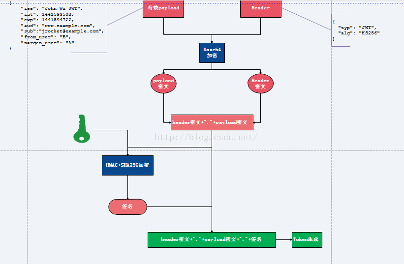

# Token认证

## 认证选择Token的原因

```
相同点: 
    本质上token 和 cookie/session都是字符串.

差异:
    token是自带加密算法和用户信息(比如用户id); cookie本身不包含用户信息,它指向的是服务器上用户的session,而由session保存用户信息. 

结果:
    token可以很容易的跨服务器, 只要不同服务器实现相同解密算法即可; 
    cookie/session是存在于某一台服务器上,要实现跨服务器比较困难,这是任何基于cookie/session应用天生的短板.
```

## Token过期时间参考

```
token, 获取受保护资源的凭证, 必须要设置过期时间. 主流网站token过期时间一般不超过1h
```

## Token过期解决方案

- 方案一:

```
重复第一次获取token的过程(比如登录, 扫描授权等), 这样做的缺点是用户体验不好, 每1小时强制登录一次几乎是无法忍受的.
```

- 方法二:

```
主动刷新Token, 主动刷新token的凭证是refresh token, 也是加密字符串, 并且和token是相关联的. 相比较获取各种资源
的token, refresh token的作用仅仅是获取刷新的token, 因此其作用和安全性都有所降低, 因此其过期时间可以设置长一些.
```

## Token生成



```
1.将荷载payload, 以及Header信息进行Base64加密, 形成密文payload密文, header密文.

2.将形成的密文用句号链接起来, 用服务端秘钥进行HS256加密, 生成签名.

3.将前面的两个密文后面用句号链接签名形成最终的token返回给服务端

注:
 1) 用户请求时携带此token(分为三部分:header密文,payload密文,签名)到服务端, 服务端解析第一部分(header密文),
    用Base64解密, 可以知道用了什么算法进行签名, 此处解析发现是HS256.

 2) 服务端使用原来的秘钥与密文(header密文+"."+payload密文)同样进行HS256运算,然后用生成的签名与token携带的签名进行对比,
    若一致说明token合法,不一致说明原文被修改.

 3) 判断是否过期, 客户端通过用Base64解密第二部分(payload密文),可以知道荷载中授权时间,以及有效期.通过这个与当前时间对比
    发现token是否过期.
```